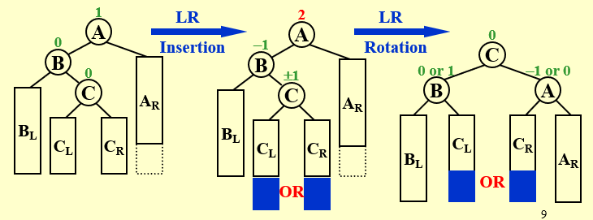
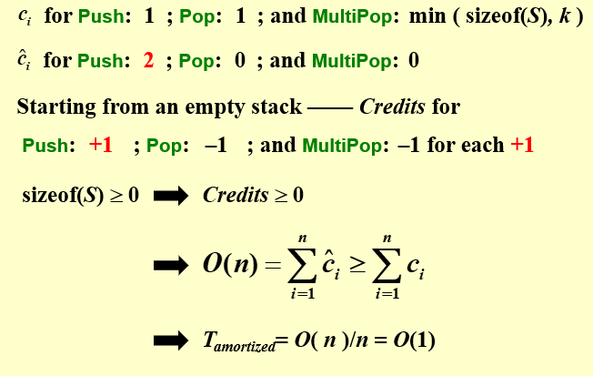
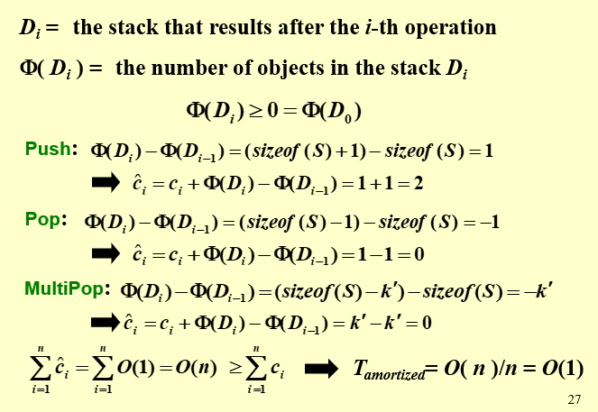
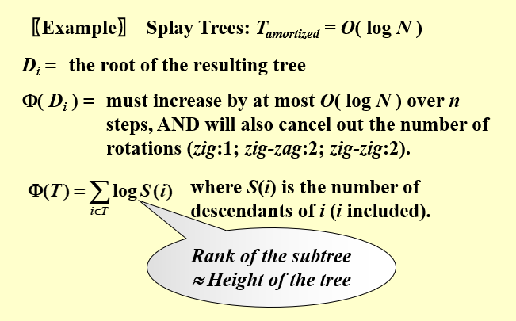
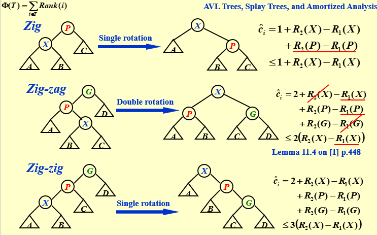

# Chapter 1: AVL Tree & Splay Tree & Amortized Analysis

## AVL Trees 

### Defination

>The height of an empty tree is defined to be **-1**  

An empty binary tree is height balanced.   
If $T$ is a nonempty binary tree with $T_L$ and $T_R$ as its left and right subtrees, then $T$ is height balanced if  
1. $T_L$ and $T_R$ are height balanced  
2. $|h_L - h_R| \leq 1$  

The **balance factor** **BF(node)** $= h_L - h_R$; In an AVL tree, BF(node) = -1, 0 or 1

### Implementation

- Single Rotation  
  - LL Rotation  
  
  - RR Rotation  
  
- Double Rotation  
  - LR Rotation  
  
  - RL Rotation  
  

>**Trouble finder**: The *lowest* unbalanced node  

### Time Complexity

$T = O(h)$  
Let $n_h$ be the minimum number of nodes in a height balanced tree of height $h$. Then the tree must look like:  


*Fibonacci* number theory gives that:   


### Coding

#### Structure Define
```c
struct AvlNode
{
    ElementType Element;
    AvlTree  Left;
    AvlTree  Right;
    int      Height;
};
```
#### Height
```c
static int
Height( Position P )
{
    if( P == NULL )
        return -1;
    else
        return P->Height;
}
```

#### Single Rotation With Left(LL Rotation)
```c
static Position
SingleRotateWithLeft( Position K2 )  // K2 is grandfather
{
    Position K1;  // K1 is parent

    K1 = K2->Left;
    K2->Left = K1->Right;
    K1->Right = K2;

    K2->Height = Max( Height( K2->Left ), Height( K2->Right ) ) + 1;  // Don't forget "+1"
    K1->Height = Max( Height( K1->Left ), K2->Height ) + 1;

    return K1;  /* New root */
}
```

#### Single Rotation With Right
```c
static Position
SingleRotateWithRight( Position K1 )
{
    Position K2;

    K2 = K1->Right;
    K1->Right = K2->Left;
    K2->Left = K1;

    K1->Height = Max( Height( K1->Left ), Height( K1->Right ) ) + 1;
    K2->Height = Max( Height( K2->Right ), K1->Height ) + 1;

    return K2;  /* New root */
}
```

#### Double Rotation With Left
```c
static Position
DoubleRotateWithLeft( Position K3 )  // K3 is grandfather
{
    /* Rotate between K1 and K2 */
    K3->Left = SingleRotateWithRight( K3->Left );

    /* Rotate between K3 and K2 */
    return SingleRotateWithLeft( K3 );
}
```

#### Double Rotation With Right
```c
static Position
DoubleRotateWithRight( Position K1 )
{
    /* Rotate between K3 and K2 */
    K1->Right = SingleRotateWithLeft( K1->Right );

    /* Rotate between K1 and K2 */
    return SingleRotateWithRight( K1 );
}
```

#### Insert
```c
AvlTree
Insert( ElementType X, AvlTree T )
{
    if( T == NULL )
    {
        /* Create and return a one-node tree */
        T = malloc( sizeof( struct AvlNode ) );
        if( T == NULL )
            FatalError( "Out of space!!!" );
        else
        {  // End of recursion to create a leaf node
            T->Element = X; T->Height = 0;
            T->Left = T->Right = NULL;
        }
    }
    else
    if( X < T->Element )
    {
        T->Left = Insert( X, T->Left );
        if( Height( T->Left ) - Height( T->Right ) == 2 )
            if( X < T->Left->Element )
                T = SingleRotateWithLeft( T );
            else
                T = DoubleRotateWithLeft( T );
    }
    else
    if( X > T->Element )
    {
        T->Right = Insert( X, T->Right );
        if( Height( T->Right ) - Height( T->Left ) == 2 )
            if( X > T->Right->Element )
                T = SingleRotateWithRight( T );
            else
                T = DoubleRotateWithRight( T );
    }
    /* Else X is in the tree already; we'll do nothing */

    T->Height = Max( Height( T->Left ), Height( T->Right ) ) + 1;
    return T;
}
```

## Splay Trees

### Defination

>After a node is accessed, it is **pushed to the root** a series of AVL tree rotations  

>Target:  
>Any *M consecutive tree operations* starting **from an empty** tree take at most **O(MlogN)** time  

easy to implement, no extra space, adaptive(continuous access)  

### Implementation

#### Splay(X)
For any nonroot node $X$, denote its parent by $P$ and gradparent by $G$:  

*case 1(zig)*: $P$ is the root -> Rotate $X$ and $P$  

*case 2*: $P$ is not the root  
- *zig-zag* $\Rightarrow$ double rotation (same as AVL)  
    

- *zig-zig* $\Rightarrow$ single rotation (**different from AVL**)  
    

#### Findkey
1. find as in BST  
2. *splay the found node*  

#### Insert
1. insert as in BST  
2. *splay the new node*  

#### Delete(X)
1. $Find(X) \Rightarrow X$ will be at the root  
2. $Remove(X)$  
3. $FindMax(T_L) \Rightarrow$ The largest element will be the root of $T_L$, and has **no right child**  
4. Make $T_R$ the right child of the root of $T_L$  

### Coding

#### Structure Define
```c
struct SplayNode
{
    ElementType Element;
    SplayTree      Left;
    SplayTree      Right;
};

typedef struct SplayNode *Position;
static Position NullNode = NULL;  /* Needs initialization */
```

#### Splay
```c
SplayTree
Splay( ElementType Item, Position X )
{
    static struct SplayNode Header;
    Position LeftTreeMax, RightTreeMin;

    Header.Left = Header.Right = NullNode;
    LeftTreeMax = RightTreeMin = &Header;
    NullNode->Element = Item;

    while( Item != X->Element )
    {
        if( Item < X->Element )
        {
            if( Item < X->Left->Element )
                X = SingleRotateWithLeft( X );
            if( X->Left == NullNode )
                break;
            /* Link right */
            RightTreeMin->Left = X;
            RightTreeMin = X;
            X = X->Left;
        }
        else
        {
            if( Item > X->Right->Element )
                X = SingleRotateWithRight( X );
            if( X->Right == NullNode )
                break;
            /* Link left */
            LeftTreeMax->Right = X;
            LeftTreeMax = X;
            X = X->Right;
        }
    }  /* while Item != X->Element */

    /* Reassemble */
    LeftTreeMax->Right = X->Left;
    RightTreeMin->Left = X->Right;
    X->Left = Header.Right;
    X->Right = Header.Left;

    return X;
}
```

#### Delete
```c
SplayTree
Remove( ElementType Item, SplayTree T )
{
    Position NewTree;

    if( T != NullNode )
    {
        T = Splay( Item, T );
        if( Item == T->Element )
        {
            /* Found it! */
            if( T->Left == NullNode )
                NewTree = T->Right;
            else
            {
                NewTree = T->Left;
                NewTree = Splay( Item, NewTree );
                NewTree->Right = T->Right;
            }
            free( T );
            T = NewTree;
        }
    }

    return T;
}
```

## Amortized Analysis

consider the worst-case running time for any **sequence of M operations**  

>Target:
>Any M consecutive operations (**from initial stat**) take at most **O(MlogN)** time $\Rightarrow$ **Amortized time bound**  

?>**worst-case bound $\geq$ amortized bound $\geq$ average-case bound**    

### Aggregate analysis
e.g. *Stack with MultiPop*  

Consider a sequence of n  
*Push*, *Pop* and *MultiPop* operations on an initially empty stack

$T_{amortized} = O(n)/n = O(1)$  

### Accounting method

>When an operation's amortized cost $\hat{c_i}$ exceeds its actual cost $c_i$, we assign the difference to specific objects in the data structure add **credit**  
>
>Credit can help pay for later operations whose amortized cost is less than their actual cost  


e.g.  



### Potential method  

Take a closer look at the **credit** $\Rightarrow$  


We call the $\phi$ **potential function**  


  

**In general, a good potential function should always assume its minimum at the start of the sequence (like 0)**  

e.g.  

  

### Analysis On the Splay Tree  

  

  


>**[Theorem]** The amortized time to splay a tree with root T at node X is at most **3(R(T) - R(X)) + 1 = O(logN)**  

  

>To sum up  
>**Amortized bound:** Average cost for M consecutive operation from some initial state  
>**Credit(Accounting method):** The different between the amortized costs and actual costs  
>**Potential(Potential method):** A function of the state of the data structure. $\phi(S)$ represents work that has been paid for but not yet performed  