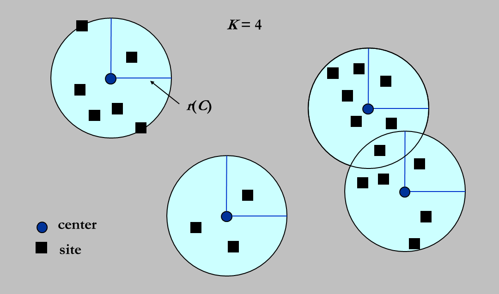
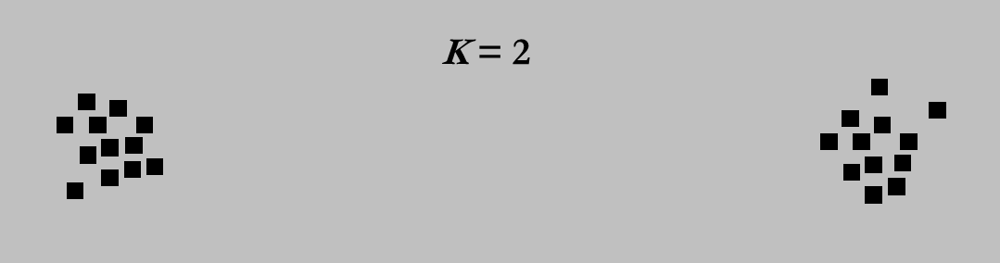

# Chapter 10: Approximation  

- **O: Optimality** -- quality of a solution  
- **E: Efficiency** -- cost of computations  
- **A: All instances**

How to get around NP-completeness?  
$\Rightarrow$ Find *near-optimal* solutions in polynomial time -- **approximation** algorithm  

>Defination  
An algorithm has an **approximation ratio** of $\rho(n)$ if, for any input of size $n$, the cost $C$ of the solution produced by the algorithm is within a factor of $\rho(n)$ of the cost $C^{*}$ of an optimal solution:  
$$
max(\frac{C}{C^{*}}, \frac{C^{*}}{C}) \leq \rho(n)
$$  
called **$\rho$-approximation algorithm**  
[Wikipedia](https://en.wikipedia.org/wiki/Approximation_algorithm)

>Defination  
An **approximation scheme** for an optimization problem is an approximation algorithm that takes as input not only an instance of the problem, but also a value $\epsilon \gt 0$ such that for any fixed $\epsilon$, the scheme is a $(1 + \epsilon)$-approximation algorithm.  
**PTAS**: *polynominal-time approximation scheme* e.g. $O(n^{\frac{2}{\epsilon}})$, $O((\frac{1}{\epsilon})^2 n^3)$  
**FPTAS**: *fully polynominal-time approximation scheme* when $\epsilon$ and $n$ are all polynominal, e.g. $O((\frac{1}{\epsilon})^2 n^3)$   
[Wikipedia](https://en.wikipedia.org/wiki/Polynomial-time_approximation_scheme)

## Example 1: Approximate Bin Packing (NP Hard)  
### Next Fit  
```c
void NextFit(){
    read item1;
    while (read item2){
        if (item2 can be packed in the same bin as item1)
            place item2 in the bin:
        else
            create a new bin for item2;
        item1 = item2;
    }
}
```
  
**Theorem:** Let $M$ be the optimal number of bins required to pack a list $I$ of items. Then *next fit* never uses more than $2M – 1$ bins. There exist sequences such that *next fit* uses $2M  – 1$ bins.  

### First Fit (O(NlogN))  
```c
void FistFit(){
    while (read item){
        scan for the first bin that is large enough for item;
        if (found)
            place item in that bin;
        else 
            create a new bin for item;
    }
}
```

**Theorem:** Let $M$ be the optimal number of bins required to pack a list $I$ of items. Then first fit never uses more than $\frac{17M}{10}$ bins. There exist sequences such that first fit uses $\frac{17(M-1)}{10}$ bins.  

### Best Fit  
Place a new item in the **tightest** spot among all bins.  

>**On-line Algorithms**  
Place an item before processing the next one, and *can NOT change decision*.  

**Theorem:** There are inputs that force any on-line bin-packing algorithm to use at least $\frac{5}{3}$ the optimal number of bins.  

>**Off-line Algorithms**  
View the entire item list before producing an answer.  

**Trouble-maker:** The large items  
**Solution:** Sort the items into non-increasing sequence of sizes. Then apply first (or best) fit -- **first (or best) fit decreasing**  
**Theorem:** Let $M$ be the optimal number of bins required to pack a list $I$ of items. Then first fit decreasing never uses more than $\frac{11M}{9} + \frac{6}{9}$ bins.  There exist sequences such that first fit decreasing uses $\frac{11M}{9} + \frac{6}{9}$ bins.  

## Example 2: The Knapsack Problem -- *0-1 version* (NP Hard)  
### Greedy
maximum profit / maximum profit density  

**Theorem:** The approximation ratio is 2.  
proof in [Isshiki修's Notebook](https://note.isshikih.top/cour_note/D2CX_AdvancedDataStructure/Lec11/#%E8%B4%AA%E5%BF%83%E5%81%9A%E6%B3%95)  

### Dynamic Programming  
$W_{i,p}$ = the minimum weight of a collection from ${1,...,i}$ with total profit being exactly $p$  
- take $i$: $W_{i,p}=w_i + W_{i-1,p-p_{i}}$  
- skip $i$: $W_{i,p}=W_{i-1,p}$  
- impossible to get $p$: $W_{i,p}=\infty$  
$\Rightarrow$ $O(n^2p_{max})$  

!>注意：input size包括Pmax的二进制编码长度d，所以Pmax=O(2^d)是指数级的复杂度。 (讲道理没看懂)  
$\Rightarrow$ Round all profit values up to lie in smaller range  

## Example 3: The K-center Problem  

  

### Naive Greedy  

Put the first center at the best possible location for a single center, and then keep adding centers so as to reduce the covering radius each time by as much as possible.

  

arbitrarily bad!  

### 2r-Greedy  

check whether $r$ is a feasible radius to see whether $r(C^{*}) \leq r$ where $C^{*}$ is the optimal solution set $\Rightarrow$ binary search  

```c
Centers Greedy-2r (Sites S[], int n, int K, double r){
    Site S'[] = S[];  // S' is the set of the remaining sites
    Centers C[] = empty;
    while (S'[] != empty){
        Select any s from S' and add it to C;
        Delete all's from S' that are at dist(s', s) <= 2r;
    }
    if (|C| <= K) return C;
    else ERROR
}
```

**Theorem:** Suppose the algorithm selects more than $K$ centers. Then for any set $C^{*}$ of size at most $K$, the covering radius is $r(C^{*}) \gt r$.  

这里做二分的时候判定十分的精妙，需要看[Isshiki修's Notebook](https://note.isshikih.top/cour_note/D2CX_AdvancedDataStructure/Lec11/#2r-greedy), ppt根本没讲清楚  

$\Rightarrow$ 2-approximation  

### Smarter Greedy  

```c
Centers Greedy-Kcenter (Sites S[], int n, int K){
    Centers C[] = empty;
    Select any s from S and add it to C;
    while (|C| < K){
        Select s from S with maximum dist(s, C);
        Add s it to C;
    }
    return C
}
```

$\Rightarrow$ still 2-approximation

**Theorem:** Unless $P = NP$, there is no $\rho$ -approximation for center-selection problem for any $\rho \lt 2$.  


