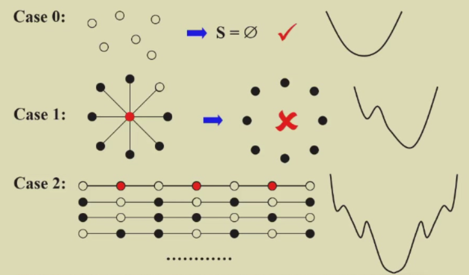
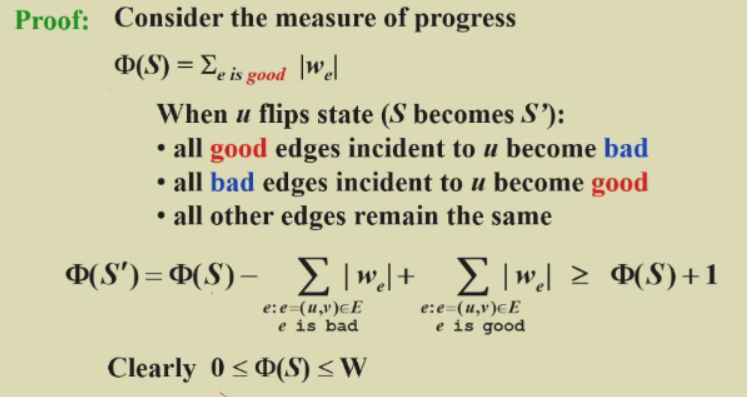
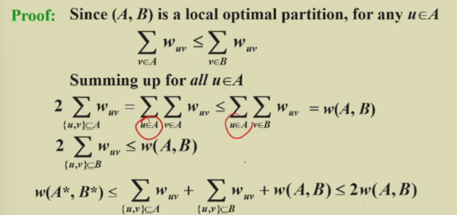

# Chapter 11: Local Search  

Solve problems **approximately** -- aims at a *local optimum*  

## Framework of Local Search  

*Local:*  
- Define *neighborhoods* in the feasible set  
- A *local optimum* is a best solution in a neighborhood  

*Search:*  
- Start with a feasible solution and search a **better** one within the neighborhood  
- A local optimum is achieved if no improvement is possible  

## Example 1: The Vertex Cover Problem  
*modification:*
Feasible solution set $\mathcal{FS}$: all the vertex covers.  
subset $V \in \mathcal{FS}$  
cost($S$)=$|S|$  
$S \sim S^{\prime}$: $S^{\prime}$ can be obtained from $S$ by (adding or) *deleting a single node*  

  

### The Metropolis Algorithm  
```c
SolutionType Metropolis()
{
    Define constants k and T;
    Start from a feasible solution S in FS;
    MinCost = cost(S);
    while (1){
        _S = Randomly chose from N(S);  // neighborhood of S, even adding is allowed  
        CurrentCost = cost(_S);
        if (CurrentCost < MinCost) {
            MinCost = CurrentCost;
            S = _S;
        }
        else {
            With a probability e^(- \Delta cost / (kT) ), let S = _S
            else break;
        }
    }
}
```
>这个代码实际是存在问题的，如过没有在局部最优解中没有上坡就直接退出了。实际上只需要固定循环一个较大的次数就好。  
>这个算法有一定概率跳出 local optimum，也可能在上坡和下坡间无限循环。当 T 很大时，上坡概率几乎为 1，容易引起底部震荡；当 T 很小时，上坡概率几乎为 0 ，类似普通梯度下降。  

#### Simulated Annealing  
T can change. (?)  

## Example 2: Hopfield Neural Networks  
[Wikipedia](https://en.wikipedia.org/wiki/Hopfield_network)  

In a configuration $S$, edge $e=(u, v)$ is **good** if $w_e s_u s_v \lt 0$ ($w_e \lt 0$ iff $s_u == s_v$); otherwise it is **bad**  

In a configuration $S$, a node $u$ is **satisfied** if the weight of incident good edges $\geq$ weight of incident bad edges  

A configuration is **stable** if all nodes are satisfied  

### State-flipping Algorithm  

```c
ConfigType State_flipping()
{
    Start from an arbitrary configuration S;
    while (!IsStable(S)){
        u = GetUnsatisfied(S);
        s_u = -s_u;
    }
    return S;
}
```

>The state-flipping algorithm terminates at a stable configuration after **at most** $W = \sum_e |w_e|$ interations  

  

!> Polynomial time algorithm?  
in N and logW (???)  

## Example 3: The Maximum Cut Problem  
[Wikipedia](https://en.wikipedia.org/wiki/Maximum_cut)  

*Related to Local Search:*  

- Problem: To *maximaize* $w(A, B)$  
- Feasible solution set $\mathcal{FS}$: any partition $(A, B)$  
- $S \sim S^{\prime}$: $S^{\prime}$ can be obtained from $S$ by moving one node from $A$ to $B$, or one from $B$ to $A$

If we again use `State_flipping` algorithm  
>Let $(A, B)$ be a local optimal partition and let $(A^*, B^*)$ be a global optimal partition. Then $w(A, B) \geq \frac{1}{2}w(A^*, B^*)$

  

### May NOT in polynomial time  
stop the algorithm when there are no "big enough" improvements  

**Big-improvement-flip:** Only choose a node which, when flipped, increases the cut value by at least  
$$
\frac{2\epsilon}{|V|}w(A, B)
$$  

>- Upon termination, the big-improvement-flip algorithm returns a cut $(A, B)$ so that  
>$$
>(2+\epsilon)w(A, B) \geq w(A^*, B^*)
>$$
>- The big-improvement-flip algorithm terminates after at most $O(\frac{n}{\epsilon log W})$  

### Try a better *local*  
The neighborhood should be **righ enough** & **not be too large**