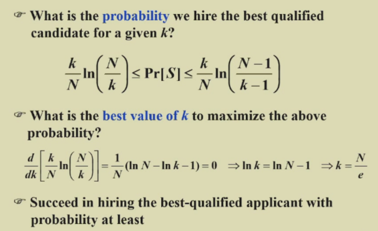

# Chapter 12: Randomized Algorithms  

## Example 1: The Hiring Problem  

### Naive Solution  
As long as $i$ is better then $1 \sim i-1$  
$\Rightarrow$ Worst case cost: $O(NC_h)$  

#### Assume candidates in *random* order  

$X$ = number of hires  
$$ X_i=\left\{
\begin{aligned}
1 & , \space \text{if candidate i is hired} \\
0 & , \space \text{if candidate i is NOT hired}
\end{aligned}
\right.
$$

$\Rightarrow$ $X = \sum_{i=1}^{N} X_i$ , $E[X_i] = Pr[\text{candidate i is hired}] = \frac{1}{i}$  

$\Rightarrow$ $E[\sum_{i=1}^{N} X_i] = \sum_{i=1}^{N}E[X_i] = \sum_{i=1}^{N} \frac{1}{i} = lnN + O(1)$  

#### Randomized Permutation Algorithm  

Assign each element $A[i]$ a *random priority* $P[i]$ and sort  

```c
void PermuteBySorting (ElemType A[], int N){
    for (int i = 1; i <= N; i++)
        A[i].P = 1 + rand()%(N^3);
    sort A, using P as the sort keys;
}
```  

### Online Hiring Algorithm  

$S_i:=$ the $i$ th applicant is *the best*, we need:  
- {$A:=$ the best one is at position}  
- {$B:=$ no one at positions $k+1 \sim i-1$ are hired}  

  

  

## Example 2: Quicksort  

- Deterministic Quicksort  
  - $\Theta (N^2)$ worst-case running time  
  - $\Theta (NlogN)$ average case running time, *assuming every input permutation is equally likely*  

**Central splitter** := the pivot that divedes the set so that each side contains at leat $\frac{n}{4}$  
**Modified Quicksort** := always select a central splitter before recursions  

  

**Claim:** The expected number of interations needed until we find a central splitter is at most 2  

$$
f(N) = f(\frac{N}{4}) + f(\frac{3N}{4}) + O(N) \Rightarrow f(N) = O(NlogN)
$$  

