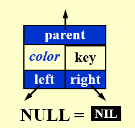
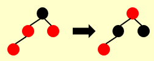
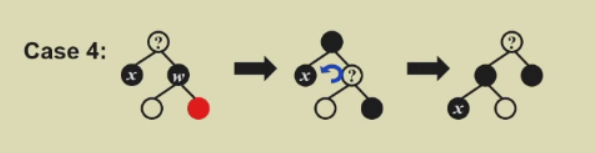
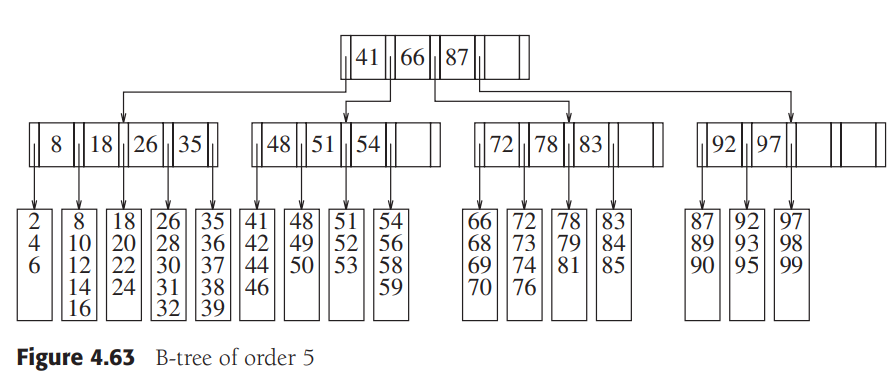

# Chapter 2: Red Blcak Tree & B+ Tree

## Red-Black Trees

[红黑树 - 定义, 插入, 构建](https://www.bilibili.com/video/BV1Xm421x7Lg/?spm_id_from=333.788&vd_source=14ad5ada89d0491ad8ab06103ead6ad6)
[红黑树 - 删除](https://www.bilibili.com/video/BV16m421u7Tb/?spm_id_from=333.788&vd_source=14ad5ada89d0491ad8ab06103ead6ad6)

### Definition

>1. node color: red or black  
>2. root is black  
>3. leaves (NIL) is black  
>4. children of red must be black  
>5. for each node $v$, all descending paths from $v$ to leaves contain the same number of black nodes  

>**Height**   
>called the black height of $v$: $bh(v)$ [excluding v]  
>$bh(T) = bh(root)$  

  

  

>**Lemma：**  
>1. A red-black tree with $N$ internal nodes has height at most $2\;ln(N + 1)$.  
>2. $bh(Tree) \geq h(Tree) / 2$  
>3. The subtree of node x has at least $2^{bh(x)} - 1$ internal nodes.
[红黑树的时间复杂度分析](https://blog.csdn.net/l_o_s/article/details/105703296?ops_request_misc=&request_id=&biz_id=102&utm_term=%E7%BA%A2%E9%BB%91%E6%A0%91%E6%97%B6%E9%97%B4%E5%A4%8D%E6%9D%82%E5%BA%A6&utm_medium=distribute.pc_search_result.none-task-blog-2~all~sobaiduweb~default-7-105703296.142^v100^pc_search_result_base8&spm=1018.2226.3001.4187)  
>  

### Implementation

#### Insert

>1. insert it as in BST  
>2. **mark the new node red**  

*case 1:* parent is black $\Rightarrow$ Done  

*case 2:* parent is red & uncle is red  

  
- parent & uncle & grandparent change color  
- check grandparent  

*case 3:* parent is red & uncle is black  

- (LL, LR, RL, RR) rotation  
- change the rotated node and rotation center(grandparent & parent)  

symmetric as the same  

#### Delete

##### Simple Delete
as if in BST(**only change the key, keep the color**)  
$\Rightarrow$ $u$ (the node should be deleted) has no child or has only one child, $u$ is black and the child is red 

##### Adjustment  

*$x$ is the problem node*(suppose $x$ on the left, symmetric as the same)

- $x$ is red $\Rightarrow$ Done  

- $x$ is black $\Rightarrow$ **Must add 1 black to the path of the replacing node**  

*case 1:* $x$'s sibling($w$) is red $\Rightarrow$ change parent & $w$'color + rotate towards $x$  

  

*case 2:* $w$ is black & $w$'s children are all black $\Rightarrow$ change $w$ into red  
- *case 2.1:* parent is red $\Rightarrow$ change parent into black  
- *case 2.2:* parent is black $\Rightarrow$ $x$ change into its parent, continue to add 1 black to the path of $x$(new $x$)  

  
  
*case 3:* $w$ is black & $w$'s left child is red & right child is black $\Rightarrow$ change $w$ into red + do RR Rotation $\Rightarrow$ *case 4*  

*case 4:* $w$ is black & $w$'s right child is red $\Rightarrow$ color change: $w$'s right child into black, $w$ into parent's color, parent into black + parent rotate towards $x$  

  

e.g.  

  

Number of *rotations*  
|   |AVL|Red-Black Tree|
|---|---|--------------|
|Insertion|$\leq$2|$\leq$2|
|Deletion|$O(logN)$|$\leq$3|

## B+ Tree

### Definition

>A B+ tree of order $M$ is an $M$-ary tree with the following properties:  
>  
>1. The data items are stored at leaves  
>2. The nonleaf nodes store up to $M - 1$ keys to guide the searching; key $i$ represents the smallest key in subtree $i + 1$  
>3. The root is either a leaf or has between $2$ and $M$ children  
>4. All nonleaf nodes(excpet the root) have betweeen $\lceil M / 2 \rceil$ and $M$ children (fanout of an internal node); for root is between $2$ and $M$  
>5. All leaves are at the same depth and have between $\lceil M / 2 \rceil$ and $M$ data items; for root being the leaf is between $1$ and $M$  

  

  
