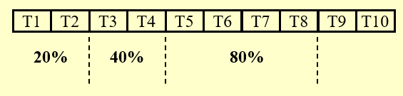
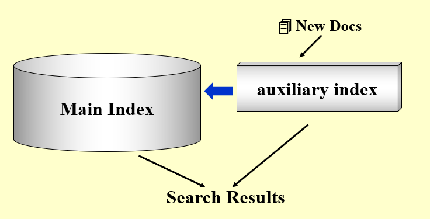
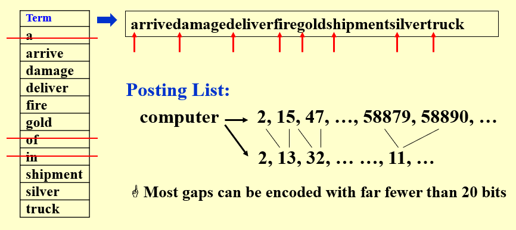
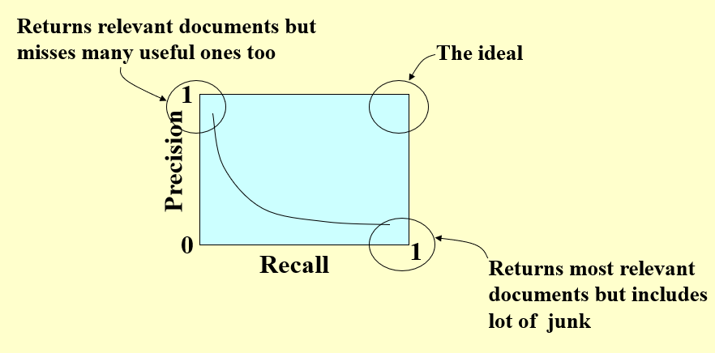

# Chapter 3: Inverted File Index

An inverted index is a database index storing a mapping from content to its locations in a table, or in a document or a set of documents. The purpose of an inverted index is to allow fast full-text searches, at a cost of increased processing when a document is added to the database. The inverted file may be the database file itself, rather than its index.   ---- WIKIPEDIA  

## Basic Form  

|No.|Term|<Times; (Document ID; Word ID)>|
|---|----|-------------------------------|
|1|Dongqianyu|<3; (6, 45), (8, 27), (9, 35)>|
| |Term Dictionary|Posting List|

>Why do we keep **"time"**(frequency)?  
>- Can save memory space when doing **Boolean Query**.  
>- Often kept in a linked list and stored for easy merging.  

```c
while ( read a document D ) {
    while ( read a term T in D ) {
        if ( Find( Dictionary, T ) == false )
            Insert( Dictionary, T );
        Get T’s posting list;
        Insert a node to T’s posting list;
    }
}
Write the inverted index to disk;
```

- **read a term T in D**: Token Analyzer; Stop Filter  
  - *Word Stemming*: only its stem or root form is left  
  - *Stop Words*: useless to index them  
  - <u>Byte Pair Encoding</u>  
- **Find( Dictionary, T )**: Vocabulary Scanner  
  - *Search Trees*: B- trees, B+ trees, Tries, ...  
  - *Hashing*  
    - pros: faster for one word  
    - cons: scanning in sequential order is not possible  
  - *Thresholding*  
    - Document: only retrieve the top x documents where the documents are ranked by weight $\Rightarrow$ <u>Not feasible for Boolean queries</u>; Can miss some relevant documents due to truncation  
    - Query: Sort the query terms by their frequency in <u>ascending</u>(low-frequency trems are more important) order; search according to only some percentage of the original query terms  
      
- **Insert( Dictionary, T )**: Vocabulary Insertor  
- **Write the inverted index to disk**: Memory management  
  - *Distributed indexing*: Each node contains index of a subset of collection  
    - Term-partitioned index: Strong disaster tolerance capability  
    - Document-partitioned index  
  - *Docs come in over time*  
    
  - *Compression*  
    
  
## Measures for a search engine 

- How fast does it index  
- How fast does it search  
- Expressiveness of query language  

### Relevance measurement
Relevance measurement requires 3 elements:  
- A benchmark document collection  
- A benchmark suite of queries  
- A binary assessment of either **Relevant** or **Irrelevant** for each *query-doc pair*  

| |Relevant|Irrelevant|
|-|--------|----------|
|Retrieved|$R_R$|$I_R$|
|Not Retrieved|$R_N$|$I_N$|

**Precision P** = $R_R / (R_R + I_R)$  
**Recall R** = $R_R / (R_R + R_N)$  


In machine learning: 
| |True(Gound Truth)|False|
|-|--------|----------|
|Positive(Pred)|TP|FP|
|Negative|TN|FN|

  

*AUC*: Area Under Curve  