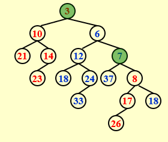

# Chapter 4: Leftist Heap & Skew Heap & Binomial Queue

## Leftist Heap

>**Targe**: Speed up merging in $O(logn)$  

Define the **null path length**, *Npl(X)*, of any node X to be the length of the shortest path from X to a node without two children

The *npl* of a node with zero or one child is 0, while *npl*(NULL) = -1

?>**Note**  
${Npl(X)=min\{NPL(C)+1 {\space} for {\space} all {\space} C {\space} as {\space} children {\space} of {\space} X \}}$

>The **leftist heap** property is that <u>for every node X in the heap, the null path length of the left child is at least as large as that of the right child</u>
>(for each u, the right decending path from u to null is one of the shortest path from u to null)

ensure the tree is unbalanced, tend to have deep left paths and is preferable to facilitate merging


Lemma:
For a leftist heap with n nodes, its right path has at most log2(n + 1) nodes.
<==> A leftist heap with r nodes on the right path must have at least 2^r - 1 nodes.


### merge  

  

### recursive version  

  

### interative version  
*Step1:* Sort the right paths without changing their left children  



*Step 2:* Swap children if necessary  

  

## Skew Heaps  

>**Target:** Any M consecutive operations take at most O(MlogN) time  

?>**Merge**  
**Always swap** the left and right children except that *the largest of all the nodes on the right paths does not have its children swapped*.  **No Npl**.  

[Skew Heap Visualization](https://www.cs.usfca.edu/~galles/JavascriptVisual/SkewHeap.html)  


### Amortized Analysis for Skew Heaps  

>**Definition**  
A node ${p}$ is **heavy** if the number of descendants of ${p}$ 's right subtree is at least half of the number of descendants of ${p}$, and **light** otherwise. Note that the number of descendants of a node includes the node itself.  
$\Rightarrow$ If $Num_{right nodes} > Num_{left nodes}$, the node is heavy, else the node is light.

!>
${D_i}=the {\space} root {\space} of {\space} the {\space} resulting {\space} tree$  
$\phi(D_i)= number {\space} of {\space} heavy {\space} node$  
The key point is that potentail function $\phi$ should include both "bad luck" and "good luck". If define $\phi$ as the number of Right Node, $\phi$ only include "bad luck".  

?>**Properties**  
If node ${p}$ is a heavy node and its right subtree is merges, ${p}$ will *definitely* turn into a light node  
If node ${p}$ is a light node and its right subtree is merges, ${p}$ *might* turn into a heavy node  
sThe only nodes whose heavy/light status can change are nodes that are *initially on the right path*.  

$\hat{c} = {c} + \phi(H_{merged}) - \phi({H_1})-\phi({H_2})$  

- ${H_i}:l_i+h_i \Rightarrow c=T_{worst}=l_1+h_1+l_2+h_2$  
- $\phi(H_{merge}) \leq l_1 + l_2 + h$  
- $\phi(H_1)+\phi(H_2) \leq h_1 + h_2 + h$  
- ${h}$ represents the heavy nodes that are  initially not on the rightest path  

$\hat{c}=c+\phi(H_{merged})-\phi(H_1)-\phi(H_2)\leq2(l_1+l_2)$  
$\Rightarrow\hat{c}=O(logN)$  

## Binomial Queue  

>**Target:** *Insert* operation takes $\Theta(1)$ under amortized analysis  

?>**Definition**
A binomial queue is a collection of *heap-ordered trees*, known as a forest. Each heap-ordered tree is a **binomial tree**.
<br/>
A binomial tree of height 0 is a one-node tree.  
A binomial tree $B_k$, of height $k$ is formed by attaching a binomial tree $B_{k–1}$, to the root of another binomial tree $B_{k–1}$. $\Rightarrow$ the number of nodes at depth $d$ is $C_k^d$    

  

### Insert  

A binomial queue of $N$ elements can be built by $N$ successive insertions in $O(N)$ time $\Rightarrow$ Insert in $O(1)$ time under amortized analysis  

  

**Proof 2:**  
$C_i=$ cost of the $i^{th}$ insertion  
$\Phi_i=$ number of trees after the $i^{th}$ insertion ($\Phi_0=0$)  

$\Rightarrow$ $\Phi_{i}=\Phi_{i-1}-(C_i-1)+1$ $\Rightarrow$ $\hat{C_i}=C_i+(\Phi_i-\Phi_{i-1})=2$  
$\Rightarrow$ $T_{amortized}=2=O(1)$  

### DeleteMin(H)  

*Step1:* FindMin in $B_k$ $\Rightarrow$ $O(logn)$  
*Step2:* Remove $B_k$ from $H$ $\Rightarrow$ $O(1)$  
*Step3:* Remove root from $B_k$ $\Rightarrow$ $O(logn)$  
*Step4:* Merge $\Rightarrow$ $O(logn)$  

### Implementation  

?>**Left-child-next-sibling** with linked lists  
When doing *Merge*, the new tree will be the *largest*. Hence maintain the subtrees **in decreasing sizes**.   

  

### Coding  

```c
BinQueue Merge(BinQueue H1, BinQueue H2)
{
    BinTree T1, T2, Carry = NULL;
    int i, j;
    if (H1->CurrentSize + H2->CurrentSize > Capacity) 
        ErrorMessage();
    H1->CurrentSize += H2->CurrentSize;
    for (i = 0, j = 1; j <= H1->CurrentSize; i++, j *= 2){  // | Carry | T2 | T1 |
        T1 = H1->TheTrees[i];
        T2 = H2->TheTrees[i];  // Current Trees
        switch (4*!!Carry + 2*!!T2 + !!T1){
            case 0:
            case 1: break;
            case 2: H1->TheTrees[i] = T2; H2->TheTrees[i] = NULL; break;
            case 3: Carry = CombineTrees(T1, T2); H1->TheTrees[i] = H2 ->TheTrees[i] = NULL; break;
            case 4: H1->TheTrees[i] = Carry; Carry = NULL; break;
            case 5: Carry = CombineTrees(T1, Carry); H1->TheTrees[i] = NULL; break;
            case 6: Carry = CombineTrees(T2, Carry); H2->TheTrees[i] = NULL; break;
            case 7: H1->TheTrees[i] = Carry; CombineTrees(T1, T2); H2->TheTrees[i] = NULL; break;
        }
    }
    return H1;
}
```

### Summary
|Operation|Find-min|Delete-min|Insert|Decrease-key|merge|
|---------|--------|----------|------|------|----|
|Binary Heap|$\Theta(1)$|$\Theta(logn)$|$O(logn)$|$O(logn)$|$\Theta(n)$|
|Leftist Heap|$\Theta(1)$|$\Theta(logn)$|$\Theta(logn)$|$O(logn)$|$\Theta(logn)$|
|Skew Heap|$\Theta(1)$|$\Theta(logn)$|<font color=red>$\Theta(logn)$</font>|<font color=red>$O(logn)$</font>|<font color=red>$\Theta(logn)$</font>|
|Binomial Queue|$\Theta(1)$|$\Theta(logn)$|<font color=red>$\Theta(1)$</font>|$O(logn)$|$O(logn)$|
|Skew Binomial Queue|$\Theta(1)$|$\Theta(logn)$|$\Theta(1)$|$\Theta(logn)$|$\Theta(logn)$|$O(logn)$|
|Fibonacci Heap|$\Theta(1)$|$O(logn)$|<font color=red>$\Theta(1)$</font>|<font color=red>$\Theta(1)$</font>|<font color=red>$\Theta(1)$</font>|

> <font color=red>Red</font> is amortized time.  


