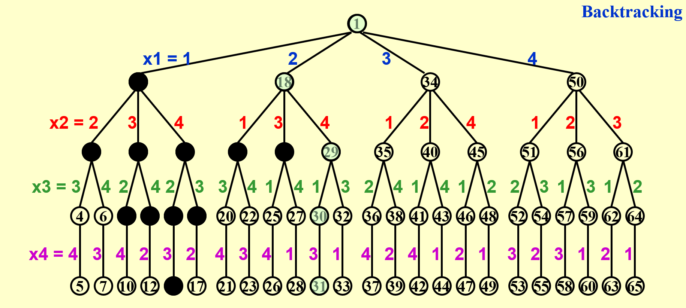
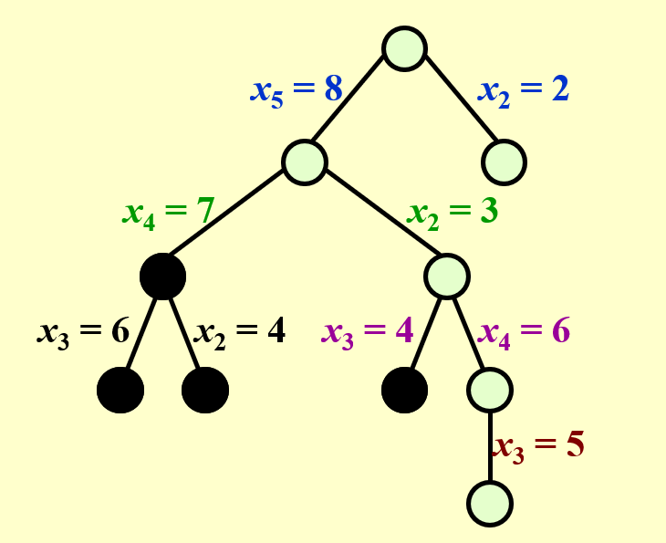
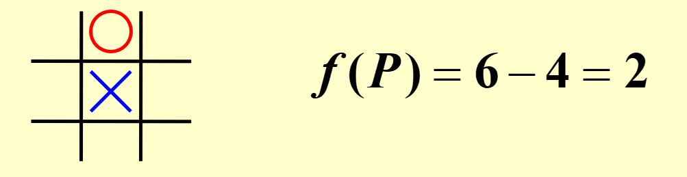

# Backtracking  

**Elements of an Algorithm**  
- Computational Problem  
- Feasibility  
- Convex Optimization/Linear Programming  
- Combinatorail Optimization  
- Integer Programming  
- Optimality  

**Backtracking** is a class of algorithms for finding solutions to some computational problems, notably *constraint satisfaction problems*, that incrementally builds candidates to the solutions, and *abandons a candidate ("backtracks")* as soon as it determines that the candidate cannot possibly be completed to a valid solution.   ---- WIKIPEDIA  

>*eliminate* the explicit examination of a large subset of the candidates while still guaranteeing that the answer will be found if the algorithm is run to termination $\Rightarrow$ **pruning**  

## Module 1: Eight Queens (Four Queens as an example)  

**Step1:** Construct a *game tree* (the *partial candidates* are represented as the nodes of a tree structure, the *potential search tree*)  $\Rightarrow$ an abstract concept    
Each path *from the root to a leaf* defines an element of th solution space  

**Step2:** The backtracking algorithm traverses this search tree recursively, from the root down, in **depth-first order**. At each node $c$, the algorithm *checks whether $c$ can be completed to a valid solution*. If it cannot, the whole sub-tree rooted at c is skipped *(pruned)*.  

  

## Module 2: The Turnpike Reconstruction Problem  

>**Problem**  
>Given $N$ points on the $x$-axis with coordinates $x_1<x_2<…<x_N$. Assume that $x_1 = 0$. There are $N ( N – 1 ) / 2$ distances between every pair of points.  
>Given $N ( N – 1 ) / 2$ distances. Reconstruct a point set from the distances.  

  

```c
bool Reconstruct(DistType X[], DistSet D, int N, int left, int right){
    // X[1]...X[left-1] and X[right+1]...X[N] are solved
    bool Found = false;
    if (Is_Empty(D))
        return true;  // solved
    D_max = Find_MAX(D);
    // option 1: X[right] = D_max
    // check if |D_max-X[i]| belongs to D for all X[i]s that have been solved  
    OK = Check(D_max, N, left, right);  // pruning
    if (OK) {  // add X[right] and update D
        X[right] = D_max;
        for (int i = 1; i < left; i++)
            Delete(|X[right] - X[i]|, D);
        for (int i = right + 1; i <= N; i++)
            Delete(|X[right] - X[i]|, D);
        Found = Reconstruct(X, D, N, left, right - 1);
        if (!Found) {  // if does not work, undo
            for (int i = 1; i < left; i++)
                Insert(|X[right] - X[i]|, D);
            for (int i = right - 1; i <= N; i++)
                Insert(|X[right] - X[i]|, D);
        }
    }
    // finish checking option 1
    if (!Found) {
        // option 2: X[left] = X[N] - D_max
        OK = Check(X[N] - D_max, N, left, right)
        if (OK) {
            X[left] = X[N] - D_max;
            for (int i = 1; i < left; i++)
                Delete(|X[left] - X[i]|, D);
            for (int i = right + 1; i <= N; i++)
                Delete(|X[left] - X[i]|, D);
            Found  = Reconstruct(X, D, N, left - 1, right);
            if (!Found) {
                for (int i = 1; i < left; i++)
                    Insert(|X[right] - X[i]|, D);
                for (int i = right + 1; i <= N; i++)
                    Insert(|X[right] - X[i]|, D);
            }
        }
    }
    return Found;
}
```

## Module 3: Tic-tac-toe  

**Minimax Strategy**  
Use an evaluation function to quantify the "goodness" of a position. For example:  
$f(P)=W_{Computer} - W_{Human}$, where W is the number of potentail wins at position P  



?>The human is trying to **minimize** the value of the position $P$, while the computer is trying to **maximize** it.  

