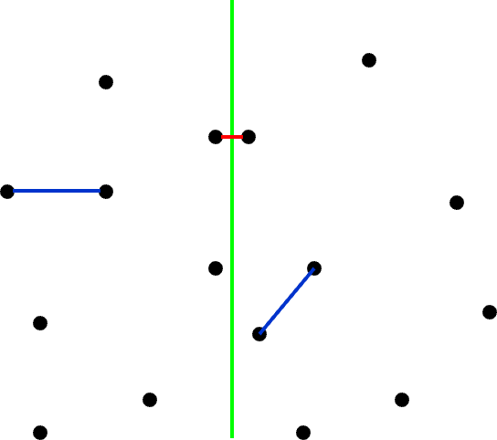
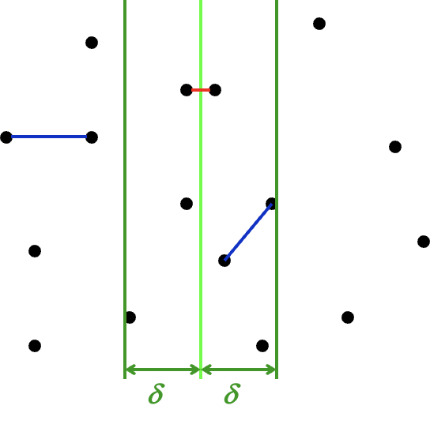
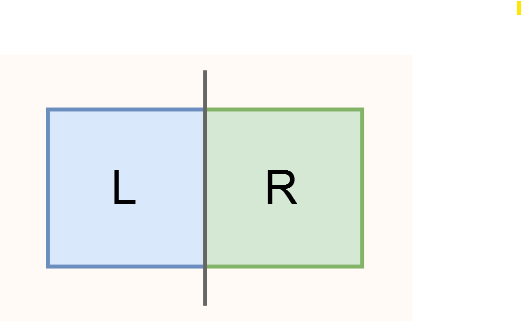
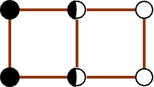

# Chapter 6: Divide & Conquer  

>Recursively  
>   **Divide** the problem into a number of sub-problems  
>   **Conquer** the sub-problems by solving them recursively  
>   **Combine** the solutions to the sub-problems into the solution for the original problem  

$\Rightarrow$ **General recurrence:** $T(N)=aT(N/b)+f(N)$  

## Example: Closest Points Problem  

Given $N$ points in a plane. Find the *closest pair* of points. (If two points have the same position, then that pair is the closest with distance $0$.)  

**Divide and Conquer Way:**  
- Sort according to x-coordinates and divide  
- Conquer by forming a solution from left, right, and cross  

  

Problem occurs when dealing with *cross*  

Suppose $min\{left, right\}=\delta$, we only need to deal with points inside the green bounds ($\delta$-strip):  

  

Moreover, the possible points-pair should be in a $2\delta \times \delta$ rectangle:  

  

and *for every points-pair in the left half or right half rectangle, the distence should be no less than* $\delta$, which means it at most contains 8 points (even with points overlaped):   

  

We enumerate all the points in left strip and it takes at most $O(N)$  

Therefore, we have:  

$T(N) = \underbrace{2\; T(\frac{N}{2})}_{\text{Step 1. divide}} + \underbrace{O(N)}_{\text{Step 2. across}} = O(N\log N) \Rightarrow$ HOW TO CALCULATE?  

## Three methods for solving recurrences:  

$T(N)=aT(N/b)+f(N)$  

Details to be ignored:  
- if $(N/b)$ is an integer or not  
- always assume $T(n)=\Theta$ for small $n$  

### Substitution method  

***Guess, then prove by induction***  

example from [Isshiki修's Notebook](https://note.isshikih.top/cour_note/D2CX_AdvancedDataStructure/Lec07/#%E4%BB%A3%E6%8D%A2%E6%B3%95)

?>$T(N) = 2\; T(\frac{N}{2}) + N$

>**预设**：$T(N) = O(N\log N)$  
>**代入**：  
> - 对于足够小的 $m < N$，有：  
>$T(\frac{m}{2}) = O(\frac{m}{2}\log \frac{m}{2}) \leq c \frac{m}{2}\log \frac{m}{2}$  
> - 将上式代入：  
> $T(m) = 2\; T(\frac{m}{2}) + m$  
> - 得：  
> $T(m) \leq 2\; c \frac{m}{2}\log \frac{m}{2} + m \leq c m \log m \text{ for } c \geq 1$  
>对于足够小的 $m = 2$ 式子就可以成立，由归纳法得结论成立。  

### Recursion-tree method  

We just keep expanding the recursion and we get something like:  

$T(N) = ... = \underbrace{\sum_{leaf_i}^{leaves}T(N_{leaf_i})}_{conquer} + \underbrace{\sum_{node_i}^{non-leaf-nodes}f(N_{node_i})}_{combine}$  

We can consider $T(N_{leaf_i})$ as a constant, therfore:  

$T(N) = ... = \underbrace{c\; N_{leaves}}_{conquer} + \underbrace{\sum_{node_i}^{non-leaf-nodes}f(N_{node_i})}_{combine}$  

Using *Recursion-tree* to make it more graphic  

?>$T(N)=3T(N/4)+\Theta(N^2)$  

  

!>some mathematical tools  
$a^{\log_b N} = \exp^{\frac{\ln N}{\ln b} \ln a} = \exp^{\frac{\ln a}{\ln b} \ln N} = N^{\log_b a}$  

### Master method  

The key point is to compare *combine part* ($f(N)$) and *conquer part* ($N^{log_ba}$) to choose a master

Vertification can check [Isshiki修's Notebook](https://note.isshikih.top/cour_note/D2CX_AdvancedDataStructure/Lec07/#%E8%AF%81%E6%98%8E)  

#### Form-1  

>Consider: $T(N)=aT(N/b)+f(N)$  
>- $f(N)=O(N^{log_ba-\epsilon})$ for some constant $\epsilon\gt 0$ $\Rightarrow$ $T(N)=\Theta(N^{log_b a})$  
>- $f(N)=\Theta(N^{log_ba}$), then $T(N)=\Theta(N^{log_ba}logN)$  
>- $f(N)=\Omega(N^{log_ba+\epsilon})$ for some constant $\epsilon\gt 0$, and if $af(\frac{N}{b})<cf(N) \text{ for } c<1 \text{ and } \forall N > N_0$ **(regularity condition)** $\Rightarrow$ $T(N)=\Theta(f(N))$  

#### Form-2  

>- if $af(\frac{N}{b}) = \kappa f(N) \text{ for fixed } \kappa < 1$, then $T(N) = \Theta(f(N))$  
>- if $af(\frac{N}{b}) = \Kappa f(N) \text{ for fixed } \Kappa > 1$, then $T(N) = \Theta(N^{\log_b{a}}) = \Theta(a^{\log_b{N}})$  
>- if $af(\frac{N}{b}) = f(N)$, then $T(N) = \Theta(f(N) \log_b N)$  

#### Form-3  

>Consider: $\begin{aligned}& T(N) = a T(\frac{n}{b}) + \Theta(N^k \log^p{N})& \text{Where } a \geq 1,\; b > 1,\; p \geq 0\end{aligned}$  
>$\Rightarrow$  $T(N) = \left\{
\begin{aligned}
& O(N^{\log_b{a}}) & \text{if } a > b^{k} \\
& O(N^k \log^{p+1}{N}) & \text{if } a = b^{k} \\
& O(N^k \log^{p}{N}) & \text{if } a < b^{k}
\end{aligned}
\right.$

>Further Reading: [Some Notes on the Master Methods](/ADS/Some%20Notes%20on%20the%20Master%20Methods.pdf)