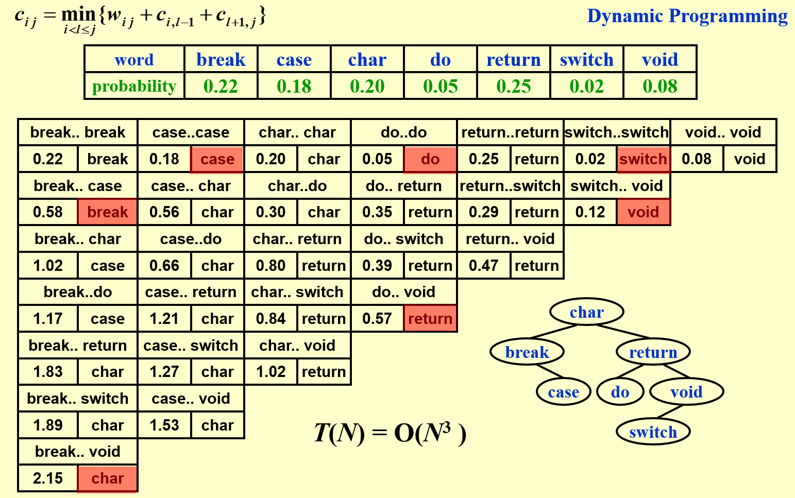
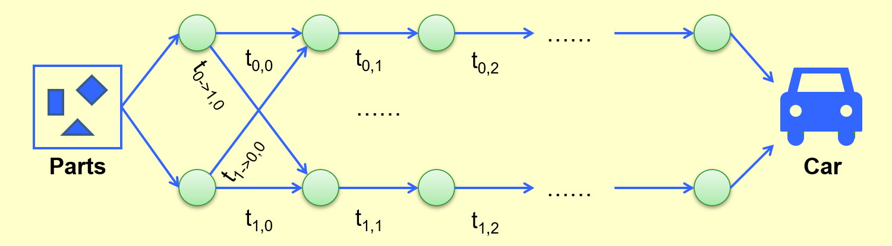

# Chapter 7: Dynamic Programming  

>*key points:* Solve sub-problems just once and save answers in a table  

## Example 1: Fibonacci Numbers  

**Solution:** Record the two most recently computed values to avoid recursive calls  

## Example 2: Ordering Matrix Multiplications  

**Problem:** In which order can we compute the product of $n$ matrices with minimal computing time?  

**Solution:** Suppose we are to multiply $n$ matrices  $M_1 \cdot {...} \cdot M_n$ where $M_i$ is an $r_{i-1}\times ri$ matrix. Let $m_{ij}$ be the cost of the optimal way to compute $M_i \cdot {...} \cdot M_j$. Then we have the recurrence equations:  
- if $i = j$, $m_{ij}=0$
- if $j > i$, $m_{ij}=\mathop{min}\limits_{i \leq l < j}\{m_{il}+m_{(l+1)j}+r_{(i-1)}r_lr_j\}$  

```c
void OptMatrix(const long r[], int N, TwoDimArray M){
    int i, j, k, L;
    long ThisM;
    for (i = 1; i <= N; i++) M[i][j] = 0;
    for (k = 1; k < N; k++){  // k = j - i, length(Opt times) first
        for (i = 1; i <= N - k; i++){
            j = i + k;
            M[i][j] = Infinity;
            for (L = i; L < j; L++){
                ThisM = M[i][L] + M[L + 1][j] + r[i - 1] * r[L] * r[j];
                if (ThisM < M[i][j])
                    M[i][j] = ThisM;
            }
        }
    }
}
```

## Example 3: Optimal Binary Search Tree  

  

## Example 4: All-Pairs Shortest Path  

**Problem:** For all pairs of $v_i$ and $v_j (i \neq j)$, find the shortest path between  

**Solution:** Difine $D^k[i][j]=min\{length \space of \space path \space i \rightarrow \{l \leq k \} \rightarrow j\}$ and $D^{-1}[i][j]=Cost[i][j]$. Then the length of the shortest path from $i$ to $j$ is $D^{N-1}[i][j]$  

If $D^{k-1}$ is done, then either:  
- $k \notin $ the shortest path $i \rightarrow \{l \leq k\} \rightarrow j \Rightarrow D^k=D^{k-1}$  
- $k \in$ the shortest path $i \rightarrow \{l \leq k\} \rightarrow j \Rightarrow D^k[i][j] = D^{k-1}[i][k]+D^{k-1}[k][j]$  
$\Rightarrow$ $D^{k}[i][j]=min\{D^{k-1}[i][j], D^{k-1}[i][k]+D^{k-1}[k][j]\}, k \geq 0$  

```c
void AllPairs(TwoDimArray A, TwoDimArry D, int N){
    for (int i = 0; i < N; i++){
        for (int j = 0; j < N; j++){
            D[i][j] = A[i][j];
        }
    }
    for (int k = 0; k < N; k++){
        for (int i = 0; i < N; i++){
            for(int j = 0; j < N; j++){
                if (D[i][k] + D[k][j] < D[i][j])
                    D[i][j] = D[i][k] + D[k][j];
            }
        }
    }
}
```

## Example 5: Product Assembly  



```c
f[0][0] = 0;
f[1][0] = 0;
for (int stage = 1; stage <= n; stage++){
    for (int line = 0; line <= 1; line++){
        f_stay = f[line][stage - 1] + t_process[line][stage - 1];
        f_move = f[1 - line][stage - 1] + t_transit[1 - line][stage - 1];
        if (f_stay < f_move)
            f[line][stage] = f_stay;
        else 
            f[line][stage] = f_move;
    }
}

```
