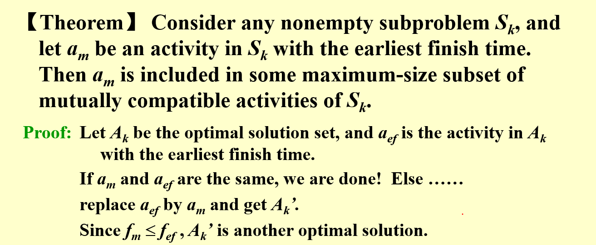
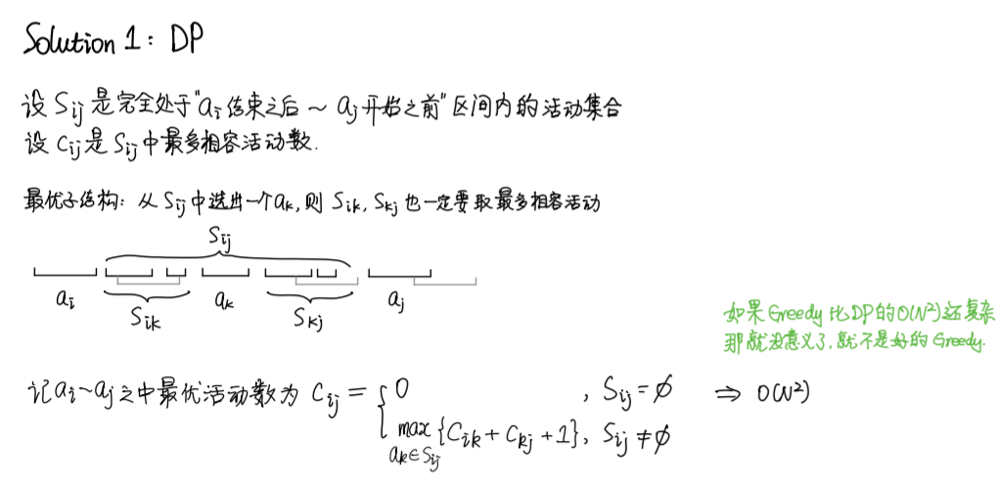
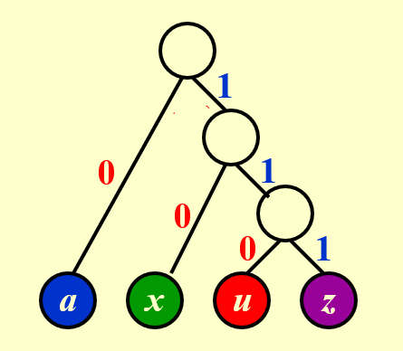
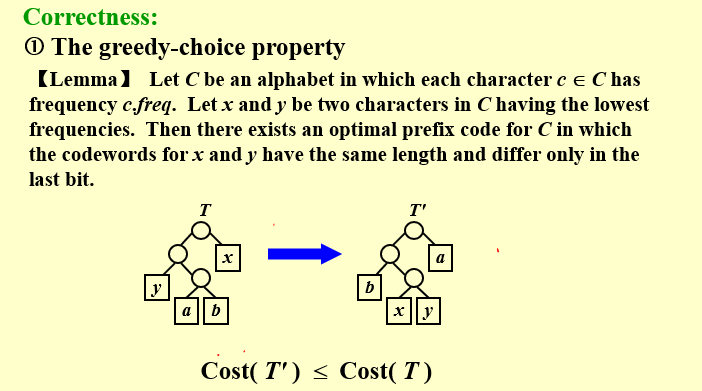
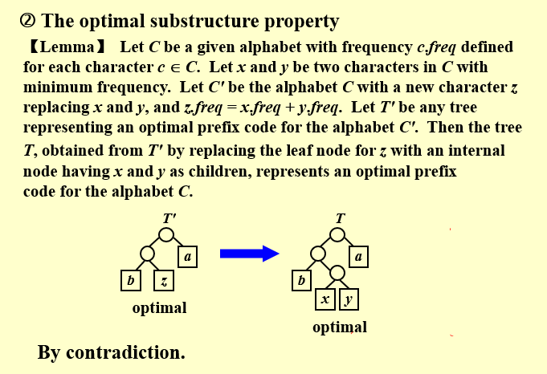

# Chapter 8: Greedy Algorithms

**Optimization Problems:**  
*constraints* $\Rightarrow$ *feasible solutions*  
*optimization function* $\Rightarrow$ *optimal solution*  

>**The Greedy Method:**  
>Make the *best* decision at each stage, under some *greedy criterion*.  A decision made in one stage is **not changed** in a later stage, so each decision should assure feasibility.  

- works only if th local optimum is equal to the global optimum  
- **does not** guarantee optimal solutions  

## Example 1: Activity Selection Problem  

>Earliest stop first.  

**Greedy Rule:** Select the interval which **ends first** (but not overlapping the already chosen intervals) $\Rightarrow$ $O(NlogN)$  

The rule seems to b correct, for the algorithm gives non-overlapping intervals. But whether the result is optimal should be proved, since it *does not guarantee optimal solutions*  

  

*A DP point of view:*
  

If each activity has a weight, DP solution was still correct, while Greedy solution faied.  

## Example 2: Huffman Codes - for file compression  

>No code is a **prefix** of another  

Representation of the optimal code in a binary tree:  
  

Any sequence of bits can always be *decoded unambiguously* if the charaters are placed only at the leaves of a **full tree** (All nodes either are leaves or have two children) - such kind of code is called ***prefix code***  

```c
void Huffman (PriorityQueue heap[], int C){
    consider the C characters as C single node binary trees, and initialize them into a min heap;
    for (int i = 1; i < C; i++){
        create a new node;
        /*be greedy here*/
        delete root from min heap and attach it to left_child of node;
        delete root from min heap and attach it to rihght_child of node;
        weight of node = sum of weights of its children;
        /*weight of a tree = sum of the frequencies of its leaves*/
        insert node into min heap;
    }
}
```
$\Rightarrow$ $T = O(ClogC)$

Correctness:  
  
  

