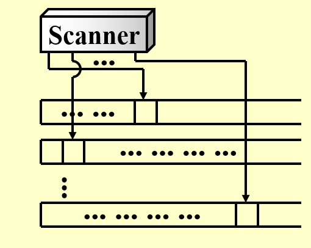
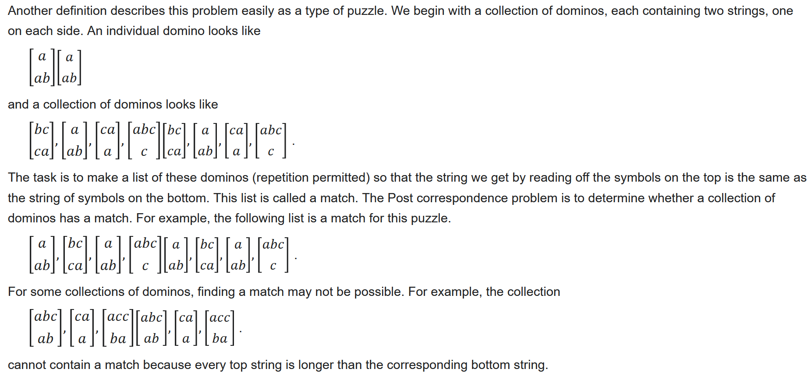
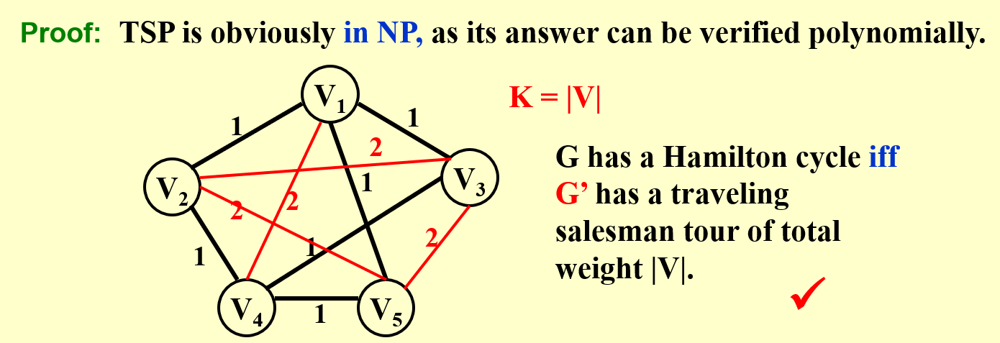
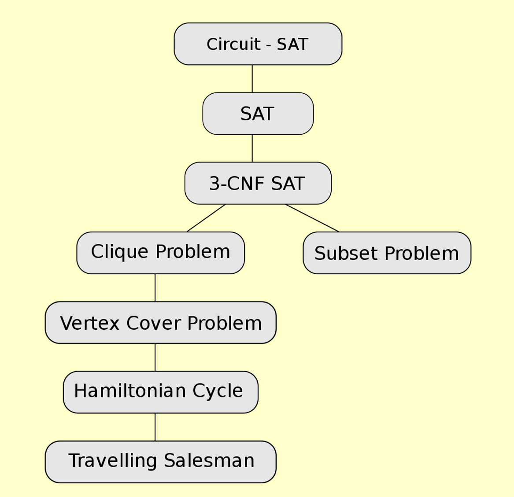
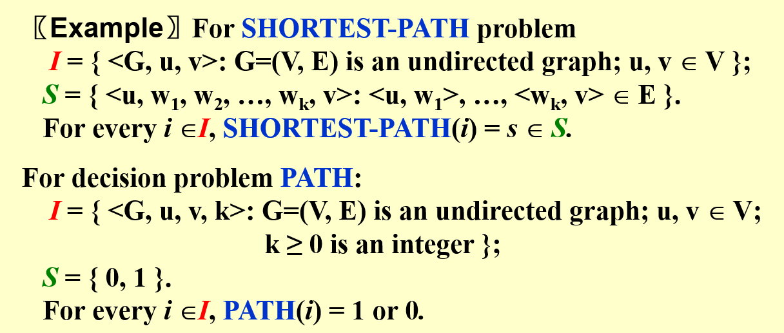
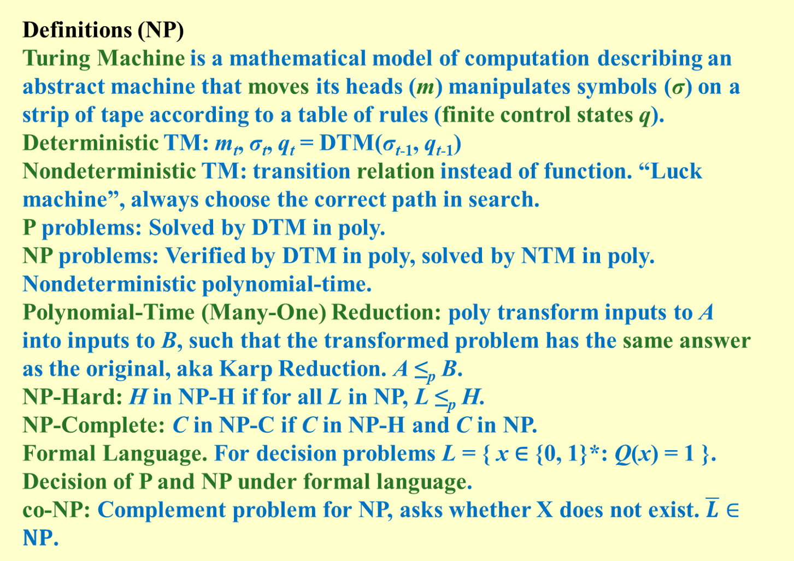
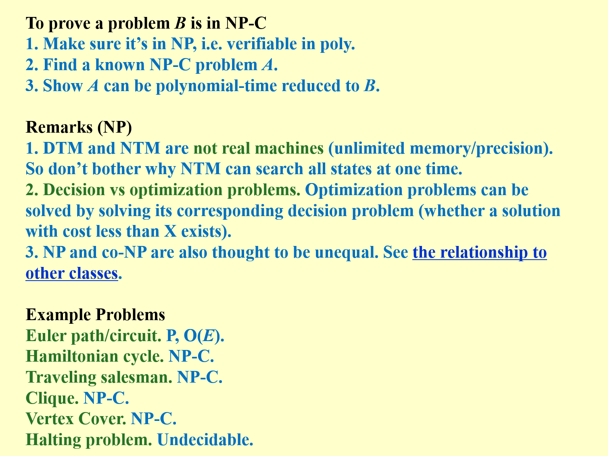

# Chapter 9: NP Completeness  

decidable in poly $\leq$ verify in poly $\leq$ in exponential $\leq$ ... $\leq$ undecidable  

## Example 1: Halting Porblem  

>Is it possible to have your C compiler detect all *infinite loops* ? [Wikipedia](https://en.wikipedia.org/wiki/Halting_problem)  

Suppose we do have a function `willHalt(func F)` which can judge *infinite loops*.

```c
void foo(){
    if (willHalt(foo)) {
        while (true)
        ;
    }
    return;
}
```

The contradiction occurs!  

[Undecidable Problem](https://en.wikipedia.org/wiki/Undecidable_problem) is a **decision problem** for which it is proved to be impossible to construct an algorithm that always leads to a correct yes-or-no answer.

## TURING MACHINE  

>TASK: To simulate any kind of *computation* which a mathematician can do by some *arithmetical method* (assuming that the mathematician has infinite time, energy, paper and pen, and is completely dedicated to the work) [Wikipedia](https://en.wikipedia.org/wiki/Turing_machine)  

Components: *infinite memory* & *scanner*  
Operations:  
- Change the finite control state  
- Erase the symbol in the unit currently pointed by head, and write a new symbol in  
- Head moves one unit to the left (L), or to the right (R), or stays at its current position (S)



### Dimino  

[Wikipedia](https://en.wikipedia.org/wiki/Post_correspondence_problem#Proof_sketch_of_undecidability)

  

Actually, if we solved this Domino problem, we solves TURING MACHINE  

>A ***Deterministic Turing Machine*** excutes one instruction at each point in time. Then depending on the instruction, it goes to the next *unique* instruction.  
>A ***Nondeterministic Turing Machine*** is *free to choose* its next step from a finite set. And if one of these steps leads to a solution, it will **always choose the correct one**.  

## P & NP & NPC & NPH  

  

### P (Polynomial Time)
A problem can be solved by a **Deterministic Turing Machine** in polynomial time.  

### NP (Nondeterministic Polynomial Time)  
A problem can be solved by a **Nondeterministic Turing Machine** in polynomial time $\Leftrightarrow$ can be vertified by a **Deterministic Turing Machine** in polynomial time.  

### NPC (NP-comleteness)  
A problem is **NP-complete** when:  
- It is a **decision** NP problem  
- It is the *hardest* among NP problems. Any problem in NP can be ***polynomially reduced*** to it.  

[Wikipedia](https://en.wikipedia.org/wiki/NP-completeness)  

?>If we can solve any NP-complete problem in polynomial time, then we will be able to solve, in polynomial time, all the problems in NP!  

### NPH (NP-hardness)  
A problem H is NPH, if for every problem L which can be solved **Nondeterministic Polynomial Time**, there is a **polynomially reduction** from L to H. [Wikipedia](https://en.wikipedia.org/wiki/NP-hardness)  
- not neccessary to ba a NP problem  
- NPC = NP $\cap$ NPH  

## Example 2: Circuit-SAT (Circuit Satisfiability Problem)  

>The **Circuit-SAT** problem is the decision problem of determining whether a given Boolean circuit has an assignment of its inputs that makes the output true. [Wikipeida](https://en.wikipedia.org/wiki/Circuit_satisfiability_problem)  

$\Rightarrow$ Input a boolean expression and ask if it has an assignment to the variables that gives the expression a value of 1.  

## Eample 3: Hamilton Cycle Problem  

>It asks if a given directed or undirected graph, G contains a *Hamiltonian cycle* (a cycle that visits each vertex exactly once) [Wikipedia](https://en.wikipedia.org/wiki/Hamiltonian_path_problem)  

Hamilton Cycle Problem is a **NPC** problem.  

### Traveling Salesman Problem (TSP)   

>Given a complete graph $G=(V, E)$, with edge costs, and an integer $K$, is there a simple cycle that visits all vertices and has total cost $\leq$ K?  

Suppose that we already know that the *Hamiltonian cycle problem* is **NP-complete**.  Prove that the *traveling salesman problem* is NP-complete as well.

  

[More details on isshikih's notebook](https://note.isshikih.top/cour_note/D2CX_AdvancedDataStructure/Lec10/#traveling-salesman-problem)

  

## A Formal-language Framework  

### Abstract Problem  
an **abstract problem** $Q$ is a binary relation on a set $I$ of **problem instances** and a set $S$ of **problem solutions**.  

  

### Encodings  
Map $I$ into a binary string $\{ 0, 1 \}^{*}$ $\Rightarrow$ Q is a **concrete problem**.  

### Formal-language Theory  
- An **alphbet** $\sum$ is a finite set of symbols  
- A **language** $L$ over $\sum$ is any set of strings made up of symbols from $\sum$  
- Denote **empty string** by $\epsilon$  
- Denote **empty language** by $\empty$  
- Language of all strings over $\sum$ is denoted by $\sum^{*}$  
etc.  

## Sum up  

  

  
