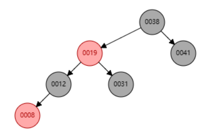

# PTA Homework of ZJU Advanced Data Structure and Algorithm

Reference:
[Jianjun Zhou's Notebook](https://zhoutimemachine.github.io/note/courses/ads-hw-review/)

## HW-1

1. If the depth of an AVL tree is 6 (the depth of an empty tree is defined to be -1), then the minimum possible number of nodes in this tree is:  
A. 13  
B. 17  
C. 20  
<mark>D. 33</mark>  
<mark>$n_h = h_{h - 1} + h_{h - 2} + 1$</mark>  

<br/>
2. For the result of accessing the keys 3, 9, 1, 5 in order in the splay tree in the following figure, which one of the following statements is FALSE?  
  
A. 5 is the root  
B. 1 and 9 are siblings  
C. 6 and 10 are siblings  
<mark>D. 3 is the parent of 4</mark>  
<br/>
3. When doing amortized analysis, which one of the following statements is FALSE?  
A. Aggregate analysis shows that for all $n$, a sequence of $n$ operations takes worst-case time $T(n)$ in total. Then the amortized cost per operation is therefore $T(n)/n$  
<mark>B. For potential method, a good potential function should always assume its ~~maximum~~（minimum） at the start of the sequence</mark>  
C. For accounting method, when an operation's amortized cost exceeds its actual cost, we save the difference as credit to pay for later operations whose amortized cost is less than their actual cost  
D. The difference between aggregate analysis and accounting method is that the later one assumes that the amortized costs of the operations may differ from each other  
<br/>
4. (**Wrong**)Insert 2, 1, 4, 5, 9, 3, 6, 7 into an initially empty AVL tree.  Which one of the following statements is FALSE?  
A. 4 is the root  
<mark>B. 3 and 7 are siblings</mark>  
C. 2 and 6 are siblings  
D. 9 is the parent of 7  

    
[AVL Tree Visulization](https://www.cs.usfca.edu/~galles/visualization/AVLtree.html)  
<br/>
5. (**Wrong**)Consider the following buffer management problem. Initially the buffer size (the number of blocks) is one. Each block can accommodate exactly one item. As soon as a new item arrives, check if there is an available block. If yes, put the item into the block, induced a cost of one. Otherwise, the buffer size is doubled, and then the item is able to put into. Moreover, the old items have to  be moved into the new buffer so it costs $k+1$ to make this insertion, where $k$ is the number of old items. Clearly, if there are N items, the worst-case cost for one insertion can be $\Omega (N)$.  To show that the average cost is O(1), let us turn to the amortized analysis. To simplify the problem, assume that the buffer is full after all the N items are placed. Which of the following potential functions works?  
A. The number of items currently in the buffer  
B. The opposite number of items currently in the buffer  
C. The number of available blocks currently in the buffer  
<mark>D. The opposite number of available blocks in the buffer</mark>  

>When given the potential function, we need to calculate $\Delta\phi$ and add it to $c_i$, which equals to $\hat{c_i}$. The potentail function is working when in every situation the $\hat{c_i}$ equals to the target average cost.  
>
>

<br/>

### Root of AVL Tree  
```c
# include <stdio.h>
# include <stdlib.h>

struct node;
typedef struct node* pos;
typedef struct node* tree;
pos LLROTATION( pos );
pos LRROTATION( pos );
pos RRROTATION( pos );
pos RLROTATION( pos );

int max( int a, int b )
{
    return ( a > b ) ? a : b;
}

struct node
{
    int element;
    tree left;
    tree right;
    int height;
};

int height( pos p )
{
    if ( p == NULL )
        return -1;
    else 
        return p->height; 
};

struct node* insert( int x, tree t )
{
    if ( t == NULL ){  // End of recursion
        t = ( struct node* )malloc( sizeof( struct node ) );  
        t->element = x;
        t->height = 0;
        t->left = NULL, t->right = NULL;
    }
    else if ( x < t->element ){  // Decide the type of rotation
        t->left = insert( x, t->left );
        if( height( t->left ) - height( t->right ) == 2 ){
            if( x < t->left->element )
                t = LLROTATION( t );
            else
                t = LRROTATION( t );
        }
    }
    else if ( x > t->element ){
        t->right = insert( x, t->right );
        if( height( t->right ) - height( t->left ) == 2 ){
            if( x > t->right->element )
                t = RRROTATION( t );
            else
                t = RLROTATION( t );
        }
    }

    t->height = max( height( t->left ), height( t->right ) ) + 1;  // "+1"
    return t;
};

pos LLROTATION( pos grandfather)
{
    pos father = grandfather->left;
    grandfather->left = father->right;
    father->right = grandfather;

    grandfather->height = max( height( grandfather->left ), height( grandfather->right ) ) + 1;
    father->height = max( height( father->left ), height( father->right ) ) + 1;

    return father;
}

pos LRROTATION( pos grandfather)
{
    pos father = grandfather->left;
    grandfather->left = RRROTATION( father );
    return LLROTATION( grandfather );
}

pos RRROTATION( pos grandfather )
{
    pos father = grandfather->right;
    grandfather->right = father->left;
    father->left = grandfather;

    grandfather->height = max( height( grandfather->left ), height( grandfather->right ) ) + 1;
    father->height = max( height( father->left ), height( father->right ) ) + 1;

    return father;
}

pos RLROTATION( pos grandfather )
{
    pos father = grandfather->right;
    grandfather->right = LLROTATION( father );
    return RRROTATION( grandfather );
}

int main()
{
    int n;
    scanf("%d", &n);

    int x;
    tree root = NULL;
    for( int i = 1; i <= n; i++){
        scanf("%d", &x);
        root = insert(x, root);
    }

    printf("%d", root->element);

    return 0;
}
```
<br/>

## EX-1

1. Amortized bounds are weaker than the corresponding worst-case bounds, because there is no guarantee for any single operation.  
<mark>A. T</mark>  
B. F  
<br/>
2. Suppose we have a potential function $\phi$ such that for all $\phi(D_i)\geq\phi(D_0)$ for all $i$, but $\phi(D_0)\neq0$. Then there exists a potential $\phi$′ such that $\phi$′$(D_0)=0$, $\phi$′$(D_i)\geq0$ for all $i\geq1$, and the amortized costs using $\phi$′ are the same as the amortized costs using $\phi$.  
<mark>A. T</mark>  
B. F
<br/>
3. For the result of accessing the keys 1 and 2 in order in the splay tree in the following figure, let's define size(v)=number of nodes in subtree of $v$ ( $v$ included ) and potential $\phi \sum v[log_⁡2\;size(v)]$, where $[x]$ means the greatest interger no larger than $x$.  
How many of the following statements is/are TRUE?  
a. the potential change from the initial tree to the resulted tree is -4 <mark>(-5?)</mark>  
<mark>b. 1 is the sibling of 4</mark>  
<mark>c. 5 is the child of 6</mark>  

<br/>
4. (**WRONG**)Insert { 9, 8, 7, 2, 3, 5, 6, 4 } one by one into an initially empty AVL tree. How many of the following statements is/are FALSE?  
   - the total number of rotations made is 5 (Note: double rotation counts 2 and single rotation counts 1)  
   - the expectation (round to 0.01) of access time is 2.75 <mark>(the root counts for 1)</mark>  
   - <mark>there are 2 nodes with a balance factor of -1</mark>  
<br/>
5. (**WRONG**)Which one of the following statements is FALSE?  
A. For red-black trees, the total cost of rebalancing for $m$ consecutive insertions in a tree of $n$ nodes is $O(n+m)$.  
<mark>B. To obtain $O(1)$ armortized time for the function decrease-key, the potential function used for Fibonacci heaps is $\phi(H)=t(H)+m(H)$, where $t(H)$ is the number of trees in the root list of heap $H$, and $m(H)$ is the number of marked nodes in $H$.(?)</mark>  
C. Let $S(x)$ be the number of descendants of $x$ ($x$ included). If the potential function used for splay tree is $\phi(T)=\sum\limits_{x\in T} log⁡S(x)$, then the amortized cost of one splay operation is O(log⁡n).  
D. In the potential method, the amortized cost of an operation is equal to the actual cost plus the increase in potential due to this operation.  

## HW-2  

1. In the red-black tree that results after successively inserting the keys 41; 38; 31; 12; 19; 8 into an initially empty red-black tree, which one of the following statements is FALSE?  
A. 38 is the root  
<mark>B. 19 and 41 are siblings, and they are both red(41 is black)</mark>  
C. 12 and 31 are siblings, and they are both black  
D. 8 is red  
  
[Red/Black Tree Visulization](https://www.cs.usfca.edu/~galles/visualization/RedBlack.html)
<br/>
2. After deleting 15 from the red-black tree given in the figure, which one of the following statements **must be**(two way of deletion) FALSE?  
  
A. 11 is the parent of 17, and 11 is black  
B. 17 is the parent of 11, and 11 is red  
<mark>C. 11 is the parent of 17, and 11 is red</mark>  
D. 17 is the parent of 11, and 17 is black  
<br/>
3. Insert 3, 1, 4, 5, 9, 2, 6, 8, 7, 0 into an initially empty 2-3 tree (with splitting).  Which one of the following statements is FALSE?  
<mark>A. 7 and 8 are in the same node</mark>  
B. the parent of the node containing 5 has 3 children  
C. the first key stored in the root is 6  
D. there are 5 leaf nodes  

<br/>
4. After deleting 9 from the 2-3 tree given in the figure, which one of the following statements is FALSE?  
  
A. the root is full  
B. the second key stored in the root is 6  
C. 6 and 8 are in the same node  
<mark>D. 6 and 5 are in the same node</mark>  
<br/>
5. Which of the following statements concerning a B+ tree of order M is TRUE?  
A. the root always has between 2 and M children  
B. not all leaves are at the same depth  
<mark>C. leaves and nonleaf nodes have some key values in common</mark>  
D. all nonleaf nodes have between $\lceil{M/2}\rceil$ and M children  

### Self-printable B+ Tree
```c
#include <stdio.h>
#include <stdlib.h>
#include <stdbool.h>

typedef struct node *tree;
struct node
{
    int key_size;
    int key[3];
    bool isLeaf;
    tree left, right, middle;
};

struct node* stack[10000];  // to store the parents(the path from root to ptr)
int top = 0;

void push(struct node* NODE){
    stack[top++] = NODE;
}

struct node* pop(){
    return stack[--top];
}

tree queue[10000];
int front, rear;

void enqueue (struct node* NODE){
    front = (front + 1) % 10000;
    queue[front] = NODE;
}

tree dequeue(){
    rear = (rear + 1) % 10000;
    return queue[rear];
}

int findrightmin(struct node* NODE){
    while (NODE->isLeaf == false){
        NODE = NODE->left;
    }
    return NODE->key[0];
}

void print(tree T){
    if (T == NULL)
        return;
    struct node* ptr = NULL;
    enqueue(T);
    int curr_layer_count = 1;
    int next_layer_count = 0;
    while (front != rear){  // BFS
        ptr = dequeue();
        if (ptr->isLeaf == false){
            curr_layer_count--;
            printf("[%d", ptr->key[0]);
            enqueue(ptr->left);
            next_layer_count++;
            if (ptr->middle != NULL){
                printf(",%d]", ptr->key[1]);
                enqueue(ptr->middle);
                next_layer_count++;
            }
            else{
                printf("]");
            }
            enqueue(ptr->right);
            next_layer_count++;
            if (curr_layer_count == 0){
                printf("\n");
                curr_layer_count = next_layer_count;
                next_layer_count = 0;
            }
        }
        else{
            printf("[%d", ptr->key[0]);
            if (ptr->key[1] != -1)
                printf(",%d", ptr->key[1]);
            if (ptr->key[2] != -1)
                printf(",%d", ptr->key[2]);
            printf("]");
        }
    } 
    printf("\n");
}

void insert(int x, tree* T)
{
    if (x < 0)
        return;
    top = 0;
    // set up the root
    if (*T == NULL){
        *T = (tree)malloc(sizeof(struct node));
        (*T)->key_size = 1;
        (*T)->key[0] = x;
        (*T)->key[1] = -1;
        (*T)->key[2] = -1;
        (*T)->isLeaf = true;
        (*T)->left = NULL;
        (*T)->right = NULL;
        (*T)->middle = NULL;
        return;
    }
    struct node *ptr = *T;
    // find the leaf
    while (ptr->isLeaf != true){
        push(ptr);
        if (ptr->key_size == 1){
            if (x < ptr->key[0])
                ptr = ptr->left;
            else if (x > ptr->key[0])
                ptr = ptr->right;
            else{ 
                printf("Key %d is duplicated\n", x);
                return;
            }
        }
        else if (ptr->key_size == 2){
            if (x < ptr->key[0])
                ptr = ptr->left;
            else if (x > ptr->key[1])
                ptr = ptr->right;
            else if (x > ptr->key[0] && x < ptr->key[1])
                ptr = ptr->middle;
            else{
                printf("Key %d is duplicated\n", x);
                return;
            }
        }
    }

    // the leaf is not full
    if (ptr->key_size != 3){
        // while (i >= 0 && x <= ptr->key[i]){
        //     if (x == ptr->key[i]){
        //         printf("Key %d is duplicated\n", x);
        //         return;
        //     }
        //     ptr->key[i + 1] = ptr->key[i];
        //     i--;
        // }
        int i = 0;
        for (; i < ptr->key_size; i++){
            if (x == ptr->key[i]){
                printf("Key %d is duplicated\n", x);
                return;
            }
        }
        i = ptr->key_size - 1;
        while (i >= 0 && x < ptr->key[i])
        {
            ptr->key[i + 1] = ptr->key[i];
            i--;
        }
        ptr->key[i + 1] = x;
        ptr->key_size++;
        return;
    }
    else{ // the leaf is full ==> split the node
        int i = 0;
        for (; i < ptr->key_size; i++){
            if (x == ptr->key[i]){
                printf("Key %d is duplicated\n", x);
                return;
            }
        }
        int val[4];
        int j = 2;
        while (j >= 0 && ptr->key[j] > x) 
            val[j + 1] = ptr->key[j], j--;
        val[j + 1] = x;
        while (j >= 0) 
            val[j] = ptr->key[j], j--;

        struct node* node1 = (struct node*)malloc(sizeof(struct node));
        struct node* node2 = (struct node*)malloc(sizeof(struct node));

        node1->isLeaf = true;
        node1->key[0] = val[0];
        node1->key[1] = val[1];
        node1->key[2] = -1;
        node1->key_size = 2;
        node1->left = NULL;
        node1->right = NULL;
        node1->middle = NULL;

        node2->isLeaf = true;
        node2->key[0] = val[2];
        node2->key[1] = val[3];
        node2->key[2] = -1;
        node2->key_size = 2;
        node2->left = NULL;
        node2->right = NULL;
        node2->middle = NULL;

        // adjustment
        struct node* parent = NULL;
        struct node* tmp = ptr;
        while (tmp != NULL){
            if (top == 0)
                parent = NULL;
            else 
                parent = pop();
            // 1. ptr is root
            if (parent == NULL){
                struct node* root = (struct node*)malloc(sizeof(struct node));
                root->isLeaf = false;
                root->key[0] = findrightmin(node2);
                root->key[1] = -1;
                root->key[2] = -1;
                root->key_size = 1;
                root->left = node1;
                root->right = node2;
                root->middle = NULL;
                *T = root;
                break;
            }
            else if (parent->key_size == 1){ // 2. the parent is not full
                if (x < parent->key[0]){
                    parent->key[1] = parent->key[0];
                    parent->key[0] = findrightmin(node2);
                    parent->key_size = 2;
                    parent->left = node1;
                    parent->middle = node2;
                    break;
                }
                else{
                    parent->key[1] = findrightmin(node2);
                    parent->key_size = 2;
                    parent->middle = node1;
                    parent->right = node2;
                    break;
                }
            }
            else if (parent->key_size == 2){ // 3. the parent is full ==> split the parent
                struct node* parent_node1 = (struct node*)malloc(sizeof(struct node));
                struct node* parent_node2 = (struct node*)malloc(sizeof(struct node));
                parent_node1->isLeaf = false;
                parent_node2->isLeaf = false;
                parent_node1->key[1] = -1;
                parent_node1->key[2] = -1;
                parent_node2->key[1] = -1;
                parent_node2->key[2] = -1;
                if (x < parent->key[0]){ // node1, node2, middle, right
                    parent_node1->left = node1;
                    parent_node1->middle = NULL;
                    parent_node1->right = node2;
                    parent_node1->key[0] = findrightmin(node2);
                    parent_node1->key_size = 1;

                    parent_node2->left = parent->middle;
                    parent_node2->middle = NULL;
                    parent_node2->right = parent->right;
                    parent_node2->key[0] = findrightmin(parent->right);
                    parent_node2->key_size = 1;
                }
                else if (x > parent->key[0] && x < parent->key[1]){ // left, node1, node2, right 
                    parent_node1->left = parent->left;
                    parent_node1->middle = NULL;
                    parent_node1->right = node1;
                    parent_node1->key[0] = findrightmin(node1);
                    parent_node1->key_size = 1;

                    parent_node2->left = node2;
                    parent_node2->middle = NULL;
                    parent_node2->right = parent->right;
                    parent_node2->key[0] = findrightmin(parent->right);
                    parent_node2->key_size = 1;
                }
                else if (x > parent->key[1]){ // left, middle, node1, node2
                    parent_node1->left = parent->left;
                    parent_node1->middle = NULL;
                    parent_node1->right = parent->middle;
                    parent_node1->key[0] = findrightmin(parent->middle);
                    parent_node1->key_size = 1;

                    parent_node2->left = node1;
                    parent_node2->middle = NULL;
                    parent_node2->right = node2;
                    parent_node2->key[0] = findrightmin(node2);
                    parent_node2->key_size = 1;
                }

                node1 = parent_node1;
                node2 = parent_node2;
                tmp = parent;
            }
        }
    }

    return;
}


int main()
{
    int n, x;
    front = 0;
    rear = 0;
    scanf("%d", &n);
    tree TREE=NULL;
    tree *T = &TREE;
    for (int i = 1; i <= n; i++){
        scanf("%d", &x);
        insert(x, T);
    }
    print(TREE);
    return 0;
}
```

## EX-2

1. (**WRONG**)If we insert $N(N\geq 2)$ nodes (with different integer elements) consecutively to build a red-black tree $T$ from an empty tree, which of the following situations is possible:  
A. All nodes in $T$ are black  
B. The number of leaf nodes (NIL) in $T$ is $2N−1$  
C. $2N$ rotations occurred during the construction of $T$  
D. The height of $T$ is $\lceil3log⁡2(N+1)\rceil$ (assume the height of the empty tree is 0)  


## HW-3

1. When evaluating the performance of data **retrieval**, it is important to measure the **relevancy** of the answer set.  
A. T  
==B. F==  
<br/>
2. While accessing a term by hashing in an inverted file index, range searches are expensive.  
==A. T==  
B. F  
<br/>

### Document Distance

Score: 6/10

```cpp
#include <cstdio>
#include <iostream>
#include <string>
#include <cmath>
#include <map>
#include <set>
#include <vector>

using namespace std;

const int MAXN = 100;

int N, M, vocabSize;
string title;

vector <int> freq[MAXN];
set <string> dict;
map <string, int> count[MAXN];
map <string, int> titleList;

double docDis(int m, int n)
{
    int sum = 0;
    for (int i = 1; i <= vocabSize; i++)
        sum += freq[m][i] * freq[n][i];

    int length_m = 0;
    for (int i = 1; i <= vocabSize; i++)
        length_m += freq[m][i] * freq[m][i];
    int length_n = 0;
    for (int i = 1; i <= vocabSize; i++)
        length_n += freq[n][i] * freq[n][i];
    
    return acos(sum * 1.0 / (sqrt(length_m) * sqrt(length_n) * 1.0));
}

string stemmer(string str){
    if (str.size() > 7 && str.substr(str.size() - 7) == "ational") {
        return(str.substr(0, str.size() - 7) + "ate");
    }
    if (str.size() > 6 && str.substr(str.size() - 6) == "tional") {
        return(str.substr(0, str.size() - 6) + "tion");
    }
    if (str.size() > 4 && str.substr(str.size() - 4) == "enci") {
        return(str.substr(0, str.size() - 4) + "ence");
    }

    ...

    if (str.size() > 2 && str.substr(str.size() - 2) == "al") {
        return(str.substr(0, str.size() - 2) + "");
    }

    return str;
}

void tokenizer(int ID){
    char ch;
    string token;
    do{
        scanf("%c", &ch);
        if (isalpha(ch))
            token += tolower(ch);
        else{
            token = stemmer(token);
            dict.insert(token);
            count[ID][token]++;
            token = "";
        }
    } while (ch != '#');
}

void setfreq(){
    for (int i = 1; i <= N; i++){
        freq[i].resize(vocabSize);
        int j = 0;
        for (auto word = dict.begin(); word != dict.end(); word++)
            freq[i][j++] = count[i][*word];
    }
}

int main()
{
    scanf("%d", &N);
    for (int ID = 1; ID <= N; ID++){
        cin >> title;
        titleList[title] = ID;
        tokenizer(ID);
    }
    vocabSize = dict.size();
    setfreq();

    string title1, title2;
    scanf("%d", &M);
    for (int i = 1; i <= M; i++){
        cin >> title1 >> title2;
        printf("Case %d: %.3f\n", i, docDis(titleList[title1], titleList[title2]));
    }
}
```

## EX-3  
1. In a search engine, thresholding for <mark>query</mark> retrieves the top $k$ documents according to their weights.  
A. T  
<mark>B. F ("Documents", not "query")</mark>  

## HW-4  
1. **(HARD)** We can perform BuildHeap for leftist heaps by considering each element as a one-node leftist heap, placing all these heaps on a queue, and performing the following step: Until only one heap is on the queue, dequeue two heaps, merge them, and enqueue the result.  Which one of the following statements is FALSE?
A. in the $k^{th}$ run, $\lceil N/2^k \rceil$ leftist heaps are formed, each contains $2^k$ nodes  
B. the worst case is when $N=2^K$ for some integer $K$  
C. the time complexity $T(N) = O(\frac{N}{2}log 2^0 + \frac{N}{2^2}log 2^1 + \frac{N}{2^3}log 2^2 + \cdots + \frac{N}{2^K}log 2^{K-1})$ for some integer $K$ so that $N=2^K$  
<mark>D. the worst case time complexity of this algorithm is $\Theta (NlogN)$</mark>  

>From C, $T(N)=O(N)$  
**$T(N)=2T(N/2)+O(logN)$** to get C  

### The function is to merge two leftist heaps H1 and H2.
```c
PriorityQueue Merge( PriorityQueue H1, PriorityQueue H2 )
{ 
    if (H1==NULL) return H2;
    if (H2==NULL) return H1;
    if [(H1->Element > H2->Element)]
        swap(H1, H2);  //swap H1 and H2
    if ( H1->Left == NULL )
        [SwapChildren(H1)];                   ;
    else {
        H1->Right = Merge( H1->Right, H2 );
        if ( H1->Left->Npl < H1->Right->Npl )
        SwapChildren( H1 );  //swap the left child and right child of H1
    [H1->Npl = H1->Right->Npl + 1];
    }
    return H1;
}
```

## EX-4  

1. Merge the two skew heaps in the following figure. How many of the following statements is/are FALSE?  
a. the null path length of 8 is the same as that of 12$\checkmark$  
b. 40 is the left child of 18$\checkmark$  
c. the depths of 18 and 33 are the same$\checkmark$  
  
<br/>
2. Delete the minimum number from the given leftist heap. Which one of the following statements is TRUE?  
  
A. 3 is NOT the root  
B. 24 is the left child of 12  
<mark>C. 8 is the left child of 7</mark>  
D. 12 is the right child of 6  

<br/>
3. Merge the two given skew heaps. Which one of the following statements is FALSE?  
A. 1 is the root  
B. 7 is the right child of 6  
<mark>C. 9 is the right child of 5</mark>  
D. 5 is the left child of 4  
  
<br/>
4. **(Wrong)** For a skew heap with N nodes, the worst-case running time of all operations (insert/delete min/merge) is $O(N)$.  
<mark>A. T</mark>(WHY???)  
B. F  

## HW-5  
1. Merge the two binomial queues in the following figure.  Which one of the following statements must be FALSE?  
A. there are two binomial trees after merging, which are $B_2$ and $B_4$  
B. 13 and 15 are the children of 4  
C. if 23 is a child of 2, then 12 must be another child of 2  
<mark>D. if 4 is a child of 2, then 23 must be another child of 2</mark>  
  
<br/>

### The functions `BinQueue_Find` and `Recur_Find` are to find X in a binomial queue H.  Return the node pointer if found, otherwise return NULL.  

```c
BinTree BinQueue_Find( BinQueue H, ElementType X )
{
    BinTree T, result = NULL;
    int i, j; 

    for( i=0, j=1; j<=H->CurrentSize; i++, j*=2) {  /* for each tree in H */
        T= H->TheTrees[i];
        if ( X [>= T->Element] ){  /* if need to search inside this tree */
            result = Recur_Find(T, X);
            if ( result != NULL ) return result;
        } 
    }
    return result;
}

BinTree Recur_Find( BinTree T, ElementType X )
{
    BinTree result = NULL;
    if ( X==T->Element ) return T;
    if ( T->LeftChild!=NULL ){
        result = Recur_Find(T->LeftChild, X);
        if ( result!=NULL ) return result;
    } 
    if ( [T->NextSibling!=NULL] )
        result = Recur_Find(T->NextSibling, X);
    return result;
}
```

## EX-5  

1. In a binomial queue, the total number of the nodes at even depth is always ___ than that of the nodes at odd depth (the root is defined to be at the depth 0).  
<mark>A. not smaller</mark>  
B. not larger  
C. smaller  
D. larger  
<br/>
2. In a binomial queue, we donote the total number of the nodes at even depth and odd depth as N1 and N2, respectively (the root is defined to be at the depth 0). Which of the following statements is FALSE?  
<mark>A. If N1 > N2, then N1 + N2 can be even.</mark>  
B. If N1 + N2 is odd, then N1 > N2.  
C. For all cases, N1 ≥ N2.  
D. For all cases, N1 - N2 ≤ 1.  
3. Which of the following statements about binomial queue is FALSE?  
A. Find-Min operation can take $\Theta(1)$.  
<mark>B. The worst case of insertion is $\Theta(N)$.</mark>  
C. The amortized time of insertion is $\Theta(1)$.    
D. Delete-Min operation can take $\Theta(logN)$.  

## HW-6  

1. Given the following game tree, which node is the first one to be pruned with α-β pruning algorithm?  
  
A. a  
B. b  
<mark>C. c</mark> (Just follw the steps on oi-wiki)  
D. d

## EX-6  

1. Given the following game tree, the red node will be pruned with $\alpha$-$\beta$ pruning algorithm if and only if ___.    
  
<mark>A. $x\ge50$</mark>  
B. $x\le65$  
C. $x\ge77$  
D. $65\le x\le 77$  
<br/>
2. Given the following game tree, node d will be pruned with α−β pruning algorithm if and only if _____.  
  
<mark>A. $b\le 68$</mark>  
B. $b\ge 86$  
C. $b\ge 58$  
D. $58 \le b  \le 68$  
<br/>
3. **(Wrong)** What makes the time complexity analysis of a backtracking algorithm very difficult is that the sizes of solution spaces may vary.  
A. T  
<mark>B. F</mark>  

## HW-7  

1. To solve a problem with input size $N$ by divide and conquer algorithm, among the following methods, \_\_ is the worst.   
A. divide into 2 sub-problems of equal complexity $N/3$ and conquer in $O(N)$  
B. divide into 2 sub-problems of equal complexity $N/3$ and conquer in $O(NlogN)$  
<mark>C. divide into 3 sub-problems of equal complexity $N/2$ and conquer in $O(N)$</mark>  
D. divide into 3 sub-problems of equal complexity$N/3$ and conquer in $O(NlogN)$  
>A. $T(N)=2T(N/3)+O(N)$ $\Rightarrow$ $N^{\log_ba}=N^{\log_32}<N$, $T=O(N)$  
>B. $T(N)=2T(N/3)+O(N\log N)$ $\Rightarrow$ $N^{\log_ba}=N^{\log_32}<N<N\log N$, $T=O(N\log N)$  
>C. $T(N)=3T(N/2)+O(N)$ $\Rightarrow$ $N^{\log_ba}=N^{\log_23}>N$, $T=O(N^{\log_23})$  
>D. $T(N)=3T(N/3)+O(N\log N)$ $\Rightarrow$ $N^{\log_ba}=N$, $T=O(N\log N)$  
<br/>
2. Which one of the following is the lowest upper bound of $T(n)$ for the following recursion $T(n)=2T(\sqrt{n})+\log n$?  
<mark>A. $O(\log n\log\log n)$</mark>  
B. $O(log^2 n)$  
C. $O(n\log n)$  
D. $O(n^2)$  
>$T(n)=2T( \sqrt{n})+\log n=2^kT(n^{1/2^k})+(k+1)\log n$  
>let $n^{1/2^k}=2$ $\Rightarrow$ $k=\log\log n$  
>therefore, $T(n)=O((k+1)\log n)=O(\log n\log\log n)$  

## HW-8  

1. Given a recurrence equation $f_{i,j,k}=f_{i,j+1,k}+\min\limits_{0\leqslant l\leqslant k} \{f_{i-1,j,l}+w_{j,l}\}$. To solve this equation in an iterative way, we cannot fill up a table as follows:  
A. for k in 0 to n: for i in 0 to n: for j in n to 0  
<mark>B. for i in 0 to n: for j in 0 to n: for k in 0 to n</mark>($f_{i,j,k}$ depends on $f_{i,j+1,k}$)  
C. for i in 0 to n: for j in n to 0: for k in n to 0  
D. for i in 0 to n: for j in n to 0: for k in 0 to n  

### Programming Contest
```c
//依次考虑是否做每个题目
//f[i][j]表示已经处理前 i 个题目，获得的总分数为 j 时需要的最短时间
int min(int a, int b){
    return a < b ? a : b;
}

int need_time(const int time[], const int score[], int happy_score, int n){
    int score_tol = 0;
    for (int i = 0; i < n; i++)
        score_tol += score[i];

    int f[n + 5][score_tol + 5];
    for (int i = 0; i <= n; i++)
        for (int j = 0; j <= score_tol; j++)
            f[i][j] = 0x3f3f3f3f;

    // printf("1");
    f[0][0] = 0;

    for (int i = 1; i <= n; i++){
        for (int j = 0; j <= score_tol; j++)
            f[i][j] = f[i - 1][j];
        for (int j = score[i - 1]; j <= score_tol; j++)
            f[i][j] = min(f[i][j], f[i - 1][j - score[i - 1]] + time[i - 1]);
    }

    int res = 0x3f3f3f3f;
    for (int j = happy_score; j <= score_tol; j++)
        res = min(res, f[n][j]);

    if (res == 0x3f3f3f3f)
        res = -1;

    return res;
}
```